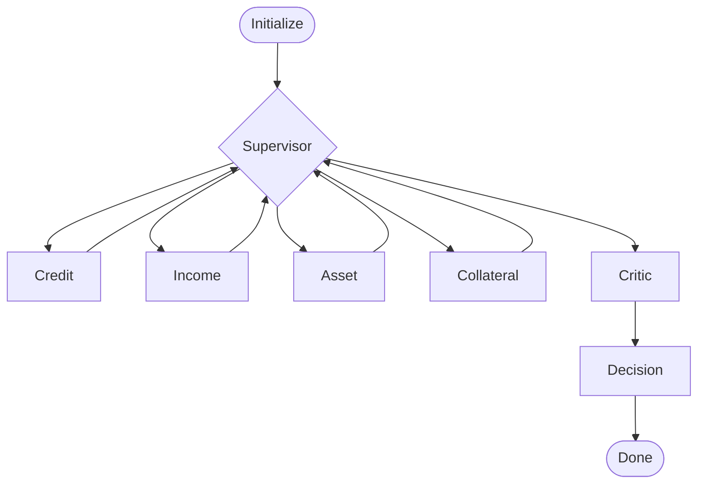

# 🏠 Underwriter Agent

[](https://github.com/alanvaa06/Underwriting_Agent/actions/workflows/test.yml)
[](https://www.python.org/downloads/)
[](LICENSE)
[](https://huggingface.co/spaces/alanvaa/underwriter-agent)

**Multi-agent mortgage underwriting demo.** Six LangGraph agents (Credit, Income, Asset, Collateral, Critic, Decision) collaborate over a synthetic applicant profile and render APPROVED / CONDITIONAL_APPROVAL / DENIED with a risk score and decision memo. Live SSE stream lights up the workflow as each agent thinks.


## Try It Live

→ **[huggingface.co/spaces/alanvaa/underwriter-agent](https://huggingface.co/spaces/alanvaa/underwriter-agent)**

Bring your own OpenAI key (used per-request, never stored). One full run ≈ $0.15.

## How It Works



A FastAPI backend (`app/`) hosts the SSE streaming endpoint. The pure-domain `underwriter/` package owns the LangGraph workflow, agents, RAG retrieval, and PII sanitization — zero web-framework imports. The static vanilla-JS frontend (`frontend/`) consumes the SSE stream and animates a Mermaid diagram of the agent graph.

RAG context is built once from `data/underwriting_policies.pdf` into a Chroma store committed to `data/chroma/` and baked into the Docker image. No HF Pro tier required.

## Local Quickstart

```bash
git clone https://github.com/alanvaa06/Underwriting_Agent.git
cd Underwriting_Agent
python -m venv .venv && source .venv/bin/activate    # or .venv\Scripts\activate on Windows
pip install -r requirements-dev.txt
export OPENAI_API_KEY=sk-...                          # only for build_chroma + e2e tests
python scripts/build_chroma.py                        # one-time vector store build
uvicorn app.main:app --reload --port 7860
# open http://localhost:7860
```

## Architecture

See [`docs/architecture.md`](docs/architecture.md) and the design spec at [`docs/superpowers/specs/2026-05-26-underwriter-mvp-design.md`](docs/superpowers/specs/2026-05-26-underwriter-mvp-design.md).

## Tech Stack

LangGraph · LangChain · FastAPI · Pydantic v2 · Chroma · OpenAI (gpt-4o) · Mermaid · Tailwind CSS

## Origin

Built from a Johns Hopkins / GreatLearning Agentic AI course lab notebook (`notebooks/Senior_Mortgage_Underwriting_Walkthrough.ipynb`) and productionized as a portfolio piece. Course content remains as a teaching artifact.

## License

MIT — see [`LICENSE`](LICENSE).
