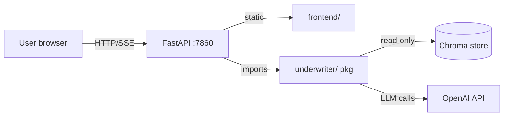
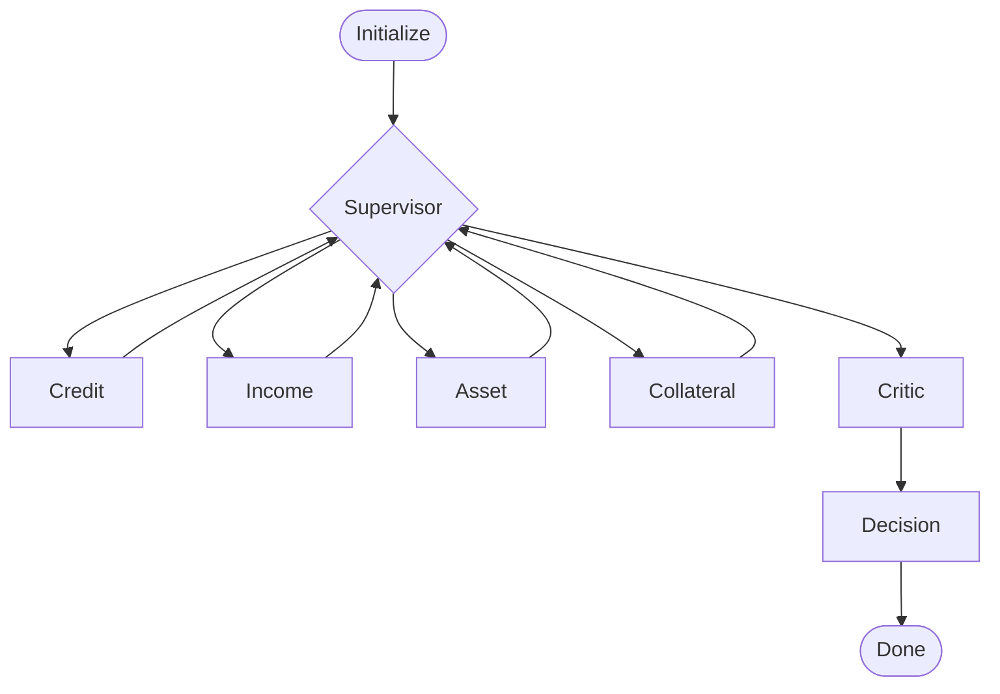

# Architecture

## High-Level Topology

Single Docker container on HF Space, port 7860. FastAPI serves both `/api/*` endpoints and the static `frontend/` SPA.



## Modules

| Path | Responsibility |
|---|---|
| `app/main.py` | FastAPI factory + lifespan (loads Chroma at boot) + static mount |
| `app/routes/run.py` | POST `/api/run` SSE endpoint |
| `app/routes/cases.py` | GET `/api/cases` — bundled examples list |
| `app/routes/health.py` | GET `/api/healthz` |
| `app/sse.py` | SSE event formatter |
| `app/schemas.py` | Pydantic v2: ApplicantIn, RunRequest, AgentEvent |
| `underwriter/state.py` | UnderwritingState TypedDict + init_state |
| `underwriter/tools.py` | compute_dti, compute_ltv, sanitize_pii |
| `underwriter/errors.py` | UnderwriterError hierarchy |
| `underwriter/rag.py` | load_or_build_store, retrieve_policy |
| `underwriter/agents/*` | One agent per file. base.py = build_llm + invoke_agent JSON wrapper. |
| `underwriter/graph.py` | LangGraph workflow + supervisor routing |
| `underwriter/streaming.py` | stream_run() → AsyncIterator[AgentEvent] |
| `frontend/` | Static SPA (HTML + Tailwind CDN + Mermaid CDN + vanilla JS) |
| `data/` | PDF policies + JSON test cases + pre-built Chroma store |

## Workflow



Supervisor routes to whichever specialist hasn't run yet; once all four analyses exist, routes to Critic. Critic flows unconditionally to Decision. Decision flows to END.

## SSE Event Protocol

```
event: agent_start       data: {"type":"agent_start","payload":{"agent":"credit"},"ts":...}
event: agent_complete    data: {"type":"agent_complete","payload":{"agent":"credit","output":{...}},"ts":...}
event: decision          data: {"type":"decision","payload":{"decision":"APPROVED","risk_score":23,"memo":"..."},"ts":...}
event: error             data: {"type":"error","payload":{"code":"OPENAI_AUTH","message":"...","recoverable":false},"ts":...}
event: ping              data: {"type":"ping","payload":{},"ts":...}   # heartbeat every 10s
event: done              data: {"type":"done","payload":{"total_duration_ms":...,"case_id":"..."},"ts":...}
```

## State Lifecycle

- **Frontend**: single in-memory object, cleared on new run, never persisted.
- **Backend**: per-request `UnderwritingState` TypedDict + `MemorySaver` checkpoint, GC'd when request ends.
- **Shared**: `app.state.vector_store` (read-only Chroma handle).
- **No DB, no Redis, no session store.** One run = one request = one stream.

## PII Path

`sanitize_pii()` runs in the `initialize` node, **before** any LLM call.

- SSN → `XXX-XX-NNNN` (last 4 only)
- Full name → first name only
- Street address dropped → city + state only
- Phone/email stripped

`state.applicant_data` = raw (for tools that need real numbers). `state.sanitized_data` = scrubbed (passed to LLM prompts). Agents read only sanitized.
