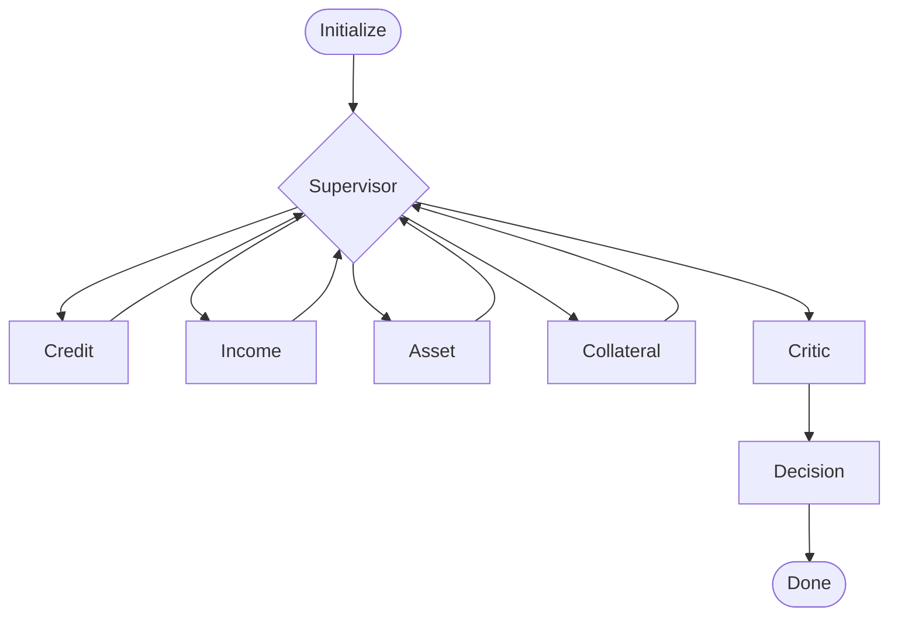
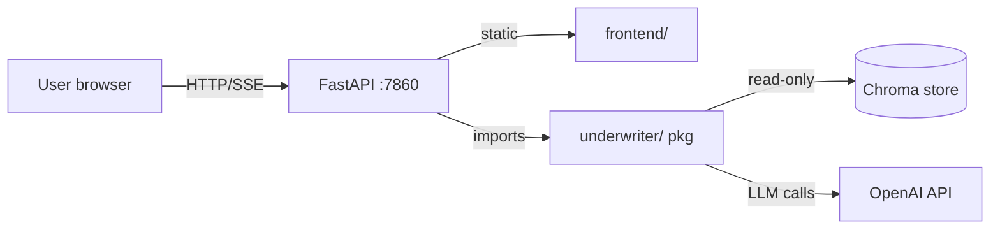

# Underwriter Agent MVP Implementation Plan

> **For agentic workers:** REQUIRED SUB-SKILL: Use superpowers:subagent-driven-development (recommended) or superpowers:executing-plans to implement this plan task-by-task. Steps use checkbox (`- [ ]`) syntax for tracking.

**Goal:** Ship public Docker HF Space serving a FastAPI app + static SPA that runs the multi-agent mortgage underwriting workflow with live SSE updates, per spec `docs/superpowers/specs/2026-05-26-underwriter-mvp-design.md`.

**Architecture:** FastAPI backend (port 7860) serves both `/api/*` routes and the static `frontend/` SPA. LangGraph workflow (initialize → supervisor → 4 specialists → critic → decision) wrapped in async SSE stream. Pure-domain `underwriter/` package separate from FastAPI shell. Pre-built Chroma vector store committed to repo, baked into Docker image. User-supplied OpenAI key per request.

**Tech Stack:** Python 3.12, FastAPI 0.115, Pydantic v2.10, LangGraph 0.2.62, LangChain 0.3.14, Chroma 0.5.23, OpenAI (`gpt-4o`), vanilla JS + Tailwind/Mermaid via CDN. Pytest + ruff + mypy. Docker on HF Spaces. GitHub Actions CI.

---

## File Map

### Created (new)

```
underwriter-agent/
├── pyproject.toml                          # package metadata, ruff + mypy config
├── requirements.txt                        # runtime deps pinned
├── requirements-dev.txt                    # dev deps pinned
├── Dockerfile                              # HF Space container
├── .gitignore                              # standard Python + project
├── .env.example                            # local dev template
│
├── app/
│   ├── __init__.py
│   ├── main.py                             # FastAPI factory + lifespan, static mount
│   ├── sse.py                              # SSE event formatter
│   ├── schemas.py                          # Pydantic v2: ApplicantIn, RunRequest, AgentEvent
│   └── routes/
│       ├── __init__.py
│       ├── run.py                          # POST /api/run → SSE stream
│       ├── cases.py                        # GET /api/cases → bundled examples
│       └── health.py                       # GET /api/healthz
│
├── underwriter/
│   ├── __init__.py
│   ├── state.py                            # UnderwritingState TypedDict + init_state
│   ├── tools.py                            # compute_dti, compute_ltv, sanitize_pii
│   ├── errors.py                           # UnderwriterError hierarchy
│   ├── rag.py                              # load_or_build_store, retrieve_policy
│   ├── streaming.py                        # stream_run() → AsyncIterator[AgentEvent]
│   ├── graph.py                            # build_workflow() + supervisor routing
│   └── agents/
│       ├── __init__.py
│       ├── base.py                         # llm factory, prompt template helpers
│       ├── credit.py
│       ├── income.py
│       ├── asset.py
│       ├── collateral.py
│       ├── critic.py
│       └── decision.py
│
├── frontend/
│   ├── index.html                          # form + results + graph viz container
│   ├── styles.css                          # custom styles atop Tailwind CDN
│   ├── app.js                              # form submit, SSE consumer, UI dispatch
│   ├── graph.js                            # mermaid render + node highlight
│   └── assets/
│       └── logo.svg
│
├── data/
│   ├── underwriting_policies.pdf           # moved from root
│   ├── test_cases.json                     # moved from root, renamed
│   └── chroma/                             # built via scripts/build_chroma.py, committed
│
├── tests/
│   ├── __init__.py
│   ├── conftest.py                         # fixtures: fake llm, applicants, vector store, client
│   ├── test_tools.py
│   ├── test_schemas.py
│   ├── test_state.py
│   ├── test_rag.py
│   ├── test_agents.py
│   ├── test_graph.py
│   ├── test_streaming.py
│   ├── test_sse.py
│   ├── test_api.py
│   ├── test_errors.py
│   └── test_e2e.py                         # skipif not OPENAI_API_KEY
│
├── scripts/
│   ├── build_chroma.py                     # PDF → data/chroma/
│   └── run_local.sh                        # uvicorn dev server
│
├── docs/
│   ├── architecture.md
│   ├── deployment.md
│   └── manual-test-plan.md
│
├── notebooks/
│   └── Senior_Mortgage_Underwriting_Walkthrough.ipynb   # moved from root
│
└── .github/
    └── workflows/
        ├── test.yml                        # ruff + pytest + mypy
        └── e2e.yml                         # manual real-LLM run
```

### Modified

- `README.md` — overwrite GitHub default with hero, badges, demo URL, quickstart
- `CLAUDE.md` — replace momentum-strategy content with mortgage-underwriting guidance

### Deleted (orphans from prior project template)

- `docs/context/memory.md`, `lessons.md`, `results.md`, `sesion-log.md`, `todo.md`
- `docs/superpowers/specs/2026-05-14-backtest-analytics-design.md`
- `docs/superpowers/plans/2026-05-13-momentum-strategy.md`
- `docs/superpowers/plans/2026-05-14-backtest-analytics.md`
- `docs/references/python_best_practices.md` (replace with project-specific later)
- `mortgage_underwriting_flowchart.html` (regenerated as `docs/architecture.md` mermaid)

---

## Task Order Rationale

1. **Phase 1 (Tasks 1-5):** Repo plumbing — git init, deps, .gitignore, restructure root, replace CLAUDE.md. Establishes clean slate.
2. **Phase 2 (Tasks 6-10):** Pure domain primitives — state, tools, errors, schemas. Pure functions, fastest tests, no LLM.
3. **Phase 3 (Tasks 11-12):** RAG layer — Chroma build + retrieve. Tested with `FakeEmbeddings`.
4. **Phase 4 (Tasks 13-19):** Agents — base + 6 specialists. Each is one focused task. Mocked LLM.
5. **Phase 5 (Tasks 20-22):** Graph + streaming — wire agents into LangGraph, async iterator.
6. **Phase 6 (Tasks 23-27):** FastAPI shell — SSE formatter, routes, main app, integration tests.
7. **Phase 7 (Tasks 28-31):** Frontend — HTML, CSS, graph viz, app logic.
8. **Phase 8 (Tasks 32-33):** End-to-end test, Docker.
9. **Phase 9 (Tasks 34-37):** CI, README, docs, HF Space deploy.

---

## Phase 1 — Repo Plumbing

### Task 1: Initialize git, set remote, push initial commit

**Files:**
- Create: `.gitignore`
- Modify: existing repo state — `git init`

- [x] **Step 1: Initialize local git repo and set remote**

```bash
cd C:/Proyectos/Underwriter_Agent
git init
git branch -M main
git remote add origin https://github.com/alanvaa06/Underwriting_Agent.git
git fetch origin
git reset origin/main   # adopts the README + LICENSE + .gitignore created on GitHub, untracks local files
```

Expected: `On branch main`, lots of untracked files (notebook, PDF, test cases, docs).

- [x] **Step 2: Write .gitignore (overwrite GitHub's default)**

```gitignore
# Python
__pycache__/
*.py[cod]
*$py.class
*.so
.Python
.venv/
venv/
env/
build/
dist/
*.egg-info/
.pytest_cache/
.mypy_cache/
.ruff_cache/
.coverage
htmlcov/

# IDE
.vscode/
.idea/
*.swp
*.swo

# OS
.DS_Store
Thumbs.db

# Project
.env
.superpowers/
data/chroma/.cache/
*.log

# Keep
!data/chroma/chroma.sqlite3
!data/chroma/**/*.bin
```

Note: `data/chroma/` is committed (per spec §5.5 strategy A). The `!` lines explicitly un-ignore.

- [x] **Step 3: Commit .gitignore**

```bash
git add .gitignore
git commit -m "chore: project-specific gitignore (Python, .venv, .superpowers)"
git push origin main
```

Expected: pushed to remote.

---

### Task 2: Restructure root — move existing assets to data/ and notebooks/

**Files:**
- Move: `mortgage_test_cases.json` → `data/test_cases.json`
- Move: `underwriting_policies.pdf` → `data/underwriting_policies.pdf`
- Move: `Senior_Mortgage_Underwriting_System_Learners_Notebook.ipynb` → `notebooks/Senior_Mortgage_Underwriting_Walkthrough.ipynb`
- Delete: `mortgage_underwriting_flowchart.html` (will regenerate as mermaid in docs)

- [x] **Step 1: Create target directories**

```bash
mkdir -p data notebooks
```

- [x] **Step 2: Move files using git mv (preserves history once committed)**

```bash
git mv mortgage_test_cases.json data/test_cases.json
git mv underwriting_policies.pdf data/underwriting_policies.pdf
git mv Senior_Mortgage_Underwriting_System_Learners_Notebook.ipynb notebooks/Senior_Mortgage_Underwriting_Walkthrough.ipynb
git rm mortgage_underwriting_flowchart.html
```

- [x] **Step 3: Commit**

```bash
git commit -m "chore: relocate fixtures into data/ and notebook into notebooks/"
git push origin main
```

---

### Task 3: Purge orphaned momentum-strategy template residue

**Files:**
- Delete: `docs/context/memory.md`, `lessons.md`, `results.md`, `sesion-log.md`, `todo.md`
- Delete: `docs/superpowers/specs/2026-05-14-backtest-analytics-design.md`
- Delete: `docs/superpowers/plans/2026-05-13-momentum-strategy.md`, `2026-05-14-backtest-analytics.md`
- Delete: `docs/references/python_best_practices.md`

- [x] **Step 1: Remove orphan files**

```bash
git rm docs/context/memory.md docs/context/lessons.md docs/context/results.md docs/context/sesion-log.md docs/context/todo.md
git rm docs/superpowers/specs/2026-05-14-backtest-analytics-design.md
git rm docs/superpowers/plans/2026-05-13-momentum-strategy.md docs/superpowers/plans/2026-05-14-backtest-analytics.md
git rm docs/references/python_best_practices.md
```

- [x] **Step 2: Verify only mortgage-relevant files remain in docs/**

```bash
find docs -type f
```

Expected: only `docs/superpowers/specs/2026-05-26-underwriter-mvp-design.md` and `docs/superpowers/plans/2026-05-26-underwriter-mvp.md`.

- [x] **Step 3: Commit**

```bash
git commit -m "chore: remove orphaned momentum-strategy template files"
git push origin main
```

---

### Task 4: Replace CLAUDE.md with mortgage-underwriting guidance

**Files:**
- Modify: `CLAUDE.md` (full rewrite)

- [x] **Step 1: Overwrite CLAUDE.md**

Write to `CLAUDE.md`:

```markdown
# CLAUDE.md

Guidance for Claude Code working in this repo.

## Project

Multi-agent mortgage underwriting system. LangGraph orchestrates 6 agents (Credit, Income, Asset, Collateral, Critic, Decision) over a synthetic applicant profile, returns APPROVED / CONDITIONAL_APPROVAL / DENIED + risk score + memo. Live demo on Hugging Face Spaces.

Origin: Johns Hopkins / GreatLearning Agentic AI lab. Production-ized as portfolio piece.

## Architecture

- `app/` — FastAPI shell. Routes, SSE, Pydantic schemas. No business logic.
- `underwriter/` — pure domain. State, tools, agents, LangGraph workflow, RAG. Zero FastAPI imports.
- `frontend/` — static SPA (vanilla JS + Tailwind CDN + Mermaid). No build step.
- `data/` — PDF policies + JSON test cases + pre-built Chroma store.
- `tests/` — pyramid: unit (mocked LLM) → integration (TestClient + SSE parse) → e2e (real LLM, gated).

Full spec: `docs/superpowers/specs/2026-05-26-underwriter-mvp-design.md`.

## Workflow

1. Read latest spec + plan in `docs/superpowers/`. Update plan checkboxes as you work.
2. **TDD.** Write failing test → minimal implementation → green → commit. One concern per commit.
3. **Mock the LLM** in unit/integration tests via `FakeListLLM`. Real-LLM tests only in `test_e2e.py`, gated by `OPENAI_API_KEY`.
4. **Inject the LLM** into agent functions — never import a global `ChatOpenAI`. Per-request keys depend on this.
5. **Never log API keys.** Never echo them in error messages. `req.api_key` is `SecretStr`.
6. **Sanitize PII** before any LLM call. Agents read `state.sanitized_data`, tools read `state.applicant_data`.
7. **Pin deps** in requirements.txt. CI enforces lockstep with Python 3.11 + 3.12.

## Principles

- **Simplicity first** — touch only what the task needs.
- **No partial fixes** — root-cause bugs.
- **Boundary integrity** — `underwriter/` must remain framework-agnostic. If you need HTTP, the work belongs in `app/`.
- **One agent per file.** One responsibility per module.

## Quick Commands

```bash
# install
pip install -r requirements.txt -r requirements-dev.txt

# build vector store (one-time, needs OPENAI_API_KEY)
python scripts/build_chroma.py

# run dev server
uvicorn app.main:app --reload --port 7860

# lint + type-check + test
ruff check .
mypy app/ underwriter/
pytest --cov=underwriter --cov=app --cov-fail-under=85
```
```

- [x] **Step 2: Commit**

```bash
git add CLAUDE.md
git commit -m "docs: rewrite CLAUDE.md for mortgage-underwriting project"
git push origin main
```

---

### Task 5: Create pyproject.toml + requirements files + .env.example

**Files:**
- Create: `pyproject.toml`
- Create: `requirements.txt`
- Create: `requirements-dev.txt`
- Create: `.env.example`

- [x] **Step 1: Write pyproject.toml**

```toml
[project]
name = "underwriter-agent"
version = "0.1.0"
description = "Multi-agent mortgage underwriting system (LangGraph + FastAPI)"
readme = "README.md"
requires-python = ">=3.11"
license = { text = "MIT" }
authors = [{ name = "Alan Vazquez" }]

[tool.ruff]
line-length = 100
target-version = "py311"

[tool.ruff.lint]
select = ["E", "F", "I", "B", "W", "UP", "N", "RUF"]
ignore = ["E501"]  # line length handled by formatter

[tool.ruff.format]
quote-style = "double"

[tool.mypy]
python_version = "3.11"
strict = true
ignore_missing_imports = true

[[tool.mypy.overrides]]
module = ["tests.*"]
strict = false

[tool.pytest.ini_options]
asyncio_mode = "auto"
testpaths = ["tests"]
addopts = "-v --tb=short"
```

- [x] **Step 2: Write requirements.txt**

```
fastapi==0.115.6
uvicorn[standard]==0.34.0
pydantic==2.10.4
python-multipart==0.0.20
langgraph==0.2.62
langchain==0.3.14
langchain-openai==0.2.14
langchain-community==0.3.14
langchain-text-splitters==0.3.5
chromadb==0.5.23
pypdf==5.1.0
sse-starlette==2.2.1
```

- [x] **Step 3: Write requirements-dev.txt**

```
-r requirements.txt
pytest==8.3.4
pytest-asyncio==0.25.0
pytest-cov==6.0.0
httpx==0.28.1
ruff==0.8.4
mypy==1.13.0
```

- [x] **Step 4: Write .env.example**

```
# Local development only. Required for scripts/build_chroma.py and tests/test_e2e.py.
# At runtime the app takes the OpenAI key from the user via the form — do NOT set it in production.
OPENAI_API_KEY=sk-...
```

- [x] **Step 5: Verify installs cleanly**

```bash
python -m venv .venv
.venv\Scripts\activate    # Windows; or: source .venv/bin/activate
pip install -r requirements-dev.txt
```

Expected: all packages install, no conflicts.

- [x] **Step 6: Commit**

```bash
git add pyproject.toml requirements.txt requirements-dev.txt .env.example
git commit -m "build: pyproject + pinned requirements + dev env template"
git push origin main
```

---

## Phase 2 — Pure Domain Primitives

### Task 6: underwriter/state.py — UnderwritingState TypedDict + init_state()

**Files:**
- Create: `underwriter/__init__.py`
- Create: `underwriter/state.py`
- Create: `tests/__init__.py`
- Create: `tests/test_state.py`

- [ ] **Step 1: Write failing test**

Write `tests/test_state.py`:

```python
from underwriter.state import UnderwritingState, init_state


def test_init_state_populates_applicant_and_defaults():
    raw = {"name": "Sarah Johnson", "credit_score": 760}
    state = init_state(applicant_data=raw, case_id="MTG-001")

    assert state["case_id"] == "MTG-001"
    assert state["applicant_data"] == raw
    assert state["sanitized_data"] == {}  # populated later by sanitize_pii
    assert state["credit_analysis"] is None
    assert state["income_analysis"] is None
    assert state["asset_analysis"] is None
    assert state["collateral_analysis"] is None
    assert state["critic_review"] is None
    assert state["decision_memo"] is None
    assert state["final_decision"] is None
    assert state["risk_score"] is None
    assert state["analysis_complete"] is False
    assert state["human_review_required"] is False
    assert state["human_review_completed"] is False
    assert state["bias_flags"] == []
    assert state["policy_violations"] == []
    assert state["reasoning_chain"] == []
    assert state["timestamp"]   # iso string
```

- [ ] **Step 2: Run test to verify it fails**

```bash
pytest tests/test_state.py -v
```

Expected: ModuleNotFoundError or ImportError on `underwriter.state`.

- [ ] **Step 3: Write underwriter/__init__.py (empty)**

```python
"""Pure domain package for the mortgage underwriter. Framework-agnostic."""
```

- [ ] **Step 4: Write tests/__init__.py (empty)**

```python
```

- [ ] **Step 5: Write underwriter/state.py**

```python
"""LangGraph workflow state schema + initializer."""

from datetime import datetime, timezone
from typing import Annotated, Any, TypedDict


class UnderwritingState(TypedDict):
    case_id: str
    applicant_data: dict[str, Any]
    sanitized_data: dict[str, Any]

    credit_analysis: str | None
    income_analysis: str | None
    asset_analysis: str | None
    collateral_analysis: str | None

    critic_review: str | None
    decision_memo: str | None
    final_decision: str | None
    risk_score: int | None

    next_agent: str | None
    analysis_complete: bool
    human_review_required: bool
    human_review_completed: bool
    human_notes: str | None

    bias_flags: list[str]
    policy_violations: list[str]

    reasoning_chain: Annotated[list[str], "append"]
    timestamp: str


def init_state(*, applicant_data: dict[str, Any], case_id: str) -> UnderwritingState:
    return UnderwritingState(
        case_id=case_id,
        applicant_data=applicant_data,
        sanitized_data={},
        credit_analysis=None,
        income_analysis=None,
        asset_analysis=None,
        collateral_analysis=None,
        critic_review=None,
        decision_memo=None,
        final_decision=None,
        risk_score=None,
        next_agent=None,
        analysis_complete=False,
        human_review_required=False,
        human_review_completed=False,
        human_notes=None,
        bias_flags=[],
        policy_violations=[],
        reasoning_chain=[],
        timestamp=datetime.now(timezone.utc).isoformat(),
    )
```

- [ ] **Step 6: Run test to verify it passes**

```bash
pytest tests/test_state.py -v
```

Expected: PASS.

- [ ] **Step 7: Commit**

```bash
git add underwriter/__init__.py underwriter/state.py tests/__init__.py tests/test_state.py
git commit -m "feat(underwriter): UnderwritingState TypedDict + init_state"
git push origin main
```

---

### Task 7: underwriter/tools.py — compute_dti, compute_ltv, sanitize_pii

**Files:**
- Create: `underwriter/tools.py`
- Create: `tests/test_tools.py`

- [x] **Step 1: Write failing tests**

Write `tests/test_tools.py`:

```python
import pytest
from underwriter.tools import compute_dti, compute_ltv, sanitize_pii


def test_compute_dti_simple():
    assert compute_dti(total_monthly_debt=3800, monthly_income=12500) == pytest.approx(0.304, abs=1e-3)


def test_compute_dti_zero_income_raises():
    with pytest.raises(ValueError, match="income must be positive"):
        compute_dti(total_monthly_debt=1000, monthly_income=0)


def test_compute_dti_negative_debt_raises():
    with pytest.raises(ValueError, match="debt cannot be negative"):
        compute_dti(total_monthly_debt=-100, monthly_income=5000)


def test_compute_ltv_simple():
    assert compute_ltv(loan_amount=400_000, property_value=500_000) == pytest.approx(0.80, abs=1e-3)


def test_compute_ltv_zero_property_raises():
    with pytest.raises(ValueError, match="property value must be positive"):
        compute_ltv(loan_amount=100_000, property_value=0)


def test_sanitize_pii_redacts_ssn_to_last_four():
    applicant = {"name": "Sarah Johnson", "ssn": "123-45-6789", "email": "x@y.com"}
    out = sanitize_pii(applicant)
    assert out["ssn"] == "XXX-XX-6789"


def test_sanitize_pii_keeps_first_name_only():
    out = sanitize_pii({"name": "Sarah Johnson"})
    assert out["name"] == "Sarah"


def test_sanitize_pii_drops_street_address_keeps_city_state():
    applicant = {"address": "1234 Oak Street, San Francisco, CA 94102"}
    out = sanitize_pii(applicant)
    assert out["address"] == "San Francisco, CA"


def test_sanitize_pii_strips_phone_and_email():
    applicant = {"phone": "555-234-5678", "email": "a@b.com"}
    out = sanitize_pii(applicant)
    assert "phone" not in out
    assert "email" not in out


def test_sanitize_pii_preserves_non_pii_keys():
    applicant = {"name": "Sarah Johnson", "credit_score": 760, "debts": {"car_loan": 1200}}
    out = sanitize_pii(applicant)
    assert out["credit_score"] == 760
    assert out["debts"] == {"car_loan": 1200}


def test_sanitize_pii_does_not_mutate_input():
    applicant = {"ssn": "123-45-6789", "name": "Sarah Johnson"}
    sanitize_pii(applicant)
    assert applicant["ssn"] == "123-45-6789"
    assert applicant["name"] == "Sarah Johnson"
```

- [x] **Step 2: Run tests to verify they fail**

```bash
pytest tests/test_tools.py -v
```

Expected: ImportError on `underwriter.tools`.

- [x] **Step 3: Write underwriter/tools.py**

```python
"""Pure computational + PII-scrubbing helpers shared across agents."""

import copy
import re
from typing import Any


def compute_dti(*, total_monthly_debt: float, monthly_income: float) -> float:
    if monthly_income <= 0:
        raise ValueError("monthly income must be positive")
    if total_monthly_debt < 0:
        raise ValueError("monthly debt cannot be negative")
    return total_monthly_debt / monthly_income


def compute_ltv(*, loan_amount: float, property_value: float) -> float:
    if property_value <= 0:
        raise ValueError("property value must be positive")
    if loan_amount < 0:
        raise ValueError("loan amount cannot be negative")
    return loan_amount / property_value


_SSN_RE = re.compile(r"^\d{3}-\d{2}-(\d{4})$")
_PII_DROP_KEYS = frozenset({"phone", "email"})


def sanitize_pii(applicant: dict[str, Any]) -> dict[str, Any]:
    """Return a deep copy with SSN/name/address scrubbed and phone/email removed."""
    out = copy.deepcopy(applicant)

    if "ssn" in out and isinstance(out["ssn"], str):
        m = _SSN_RE.match(out["ssn"])
        if m:
            out["ssn"] = f"XXX-XX-{m.group(1)}"

    if "name" in out and isinstance(out["name"], str):
        out["name"] = out["name"].split()[0]

    if "address" in out and isinstance(out["address"], str):
        # take last two comma-separated components, drop ZIP from state if present
        parts = [p.strip() for p in out["address"].split(",")]
        if len(parts) >= 3:
            city = parts[-2]
            state_zip = parts[-1].split()
            state = state_zip[0] if state_zip else parts[-1]
            out["address"] = f"{city}, {state}"

    for k in _PII_DROP_KEYS:
        out.pop(k, None)

    return out
```

- [x] **Step 4: Run tests to verify they pass**

```bash
pytest tests/test_tools.py -v
```

Expected: 10 PASS.

- [x] **Step 5: Commit**

```bash
git add underwriter/tools.py tests/test_tools.py
git commit -m "feat(underwriter): compute_dti, compute_ltv, sanitize_pii"
git push origin main
```

---

### Task 8: underwriter/errors.py — UnderwriterError hierarchy

**Files:**
- Create: `underwriter/errors.py`
- Create: `tests/test_errors_module.py`

- [x] **Step 1: Write failing test**

Write `tests/test_errors_module.py`:

```python
import pytest
from underwriter.errors import (
    AgentParseError,
    AuthError,
    RAGError,
    RateLimitError,
    TimeoutError,
    UnderwriterError,
)


def test_base_has_code_and_recoverable_default():
    e = UnderwriterError("boom")
    assert e.code == "UNKNOWN"
    assert e.recoverable is False


def test_auth_error_code_and_recoverable_false():
    e = AuthError("bad key")
    assert isinstance(e, UnderwriterError)
    assert e.code == "OPENAI_AUTH"
    assert e.recoverable is False


def test_rate_limit_recoverable():
    e = RateLimitError("429")
    assert e.code == "OPENAI_RATE_LIMIT"
    assert e.recoverable is True


def test_timeout_recoverable():
    e = TimeoutError("slow")
    assert e.code == "OPENAI_TIMEOUT"
    assert e.recoverable is True


def test_rag_error_recoverable():
    e = RAGError("chroma down")
    assert e.code == "RAG_RETRIEVE"
    assert e.recoverable is True


def test_agent_parse_not_recoverable():
    e = AgentParseError("bad json")
    assert e.code == "AGENT_PARSE"
    assert e.recoverable is False


def test_all_errors_are_underwriter_error():
    for cls in [AuthError, RateLimitError, TimeoutError, RAGError, AgentParseError]:
        assert issubclass(cls, UnderwriterError)
```

- [x] **Step 2: Run test to verify it fails**

```bash
pytest tests/test_errors_module.py -v
```

Expected: ImportError.

- [x] **Step 3: Write underwriter/errors.py**

```python
"""Typed exception hierarchy mapped to SSE error codes in app/routes/run.py."""


class UnderwriterError(Exception):
    code: str = "UNKNOWN"
    recoverable: bool = False


class AuthError(UnderwriterError):
    code = "OPENAI_AUTH"
    recoverable = False


class RateLimitError(UnderwriterError):
    code = "OPENAI_RATE_LIMIT"
    recoverable = True


class TimeoutError(UnderwriterError):  # noqa: A001 — intentional shadow, namespaced via import
    code = "OPENAI_TIMEOUT"
    recoverable = True


class RAGError(UnderwriterError):
    code = "RAG_RETRIEVE"
    recoverable = True


class AgentParseError(UnderwriterError):
    code = "AGENT_PARSE"
    recoverable = False
```

- [x] **Step 4: Run test to verify it passes**

```bash
pytest tests/test_errors_module.py -v
```

Expected: 7 PASS.

- [x] **Step 5: Commit**

```bash
git add underwriter/errors.py tests/test_errors_module.py
git commit -m "feat(underwriter): UnderwriterError exception hierarchy"
git push origin main
```

---

### Task 9: app/schemas.py — Pydantic v2 models for ApplicantIn, RunRequest, AgentEvent

**Files:**
- Create: `app/__init__.py`
- Create: `app/schemas.py`
- Create: `tests/test_schemas.py`

- [x] **Step 1: Write failing tests**

Write `tests/test_schemas.py`:

```python
import pytest
from pydantic import ValidationError

from app.schemas import (
    AgentEvent,
    ApplicantIn,
    Assets,
    CreditHistory,
    Debts,
    Employment,
    LoanRequest,
    PropertyInfo,
    RunRequest,
)


def _valid_applicant_dict() -> dict:
    return {
        "name": "Sarah Johnson",
        "credit_score": 760,
        "credit_history": {
            "bankruptcies": 0,
            "foreclosures": 0,
            "late_payments_12mo": 0,
            "late_payments_24mo": 0,
            "oldest_tradeline_years": 15,
        },
        "employment": {
            "employer": "Tech Solutions Inc",
            "position": "Senior Software Engineer",
            "years": 6.5,
            "monthly_income": 12500,
            "type": "W2",
        },
        "debts": {
            "car_loan": 1200,
            "student_loan": 800,
            "credit_cards": 1800,
        },
        "assets": {
            "checking": 85000,
            "savings": 100000,
            "investments": 0,
            "retirement": 0,
        },
        "property_info": {
            "purchase_price": 800000,
            "property_type": "single_family",
            "occupancy": "primary",
        },
        "loan": {
            "loan_amount": 640000,
            "down_payment": 160000,
            "term_years": 30,
        },
    }


def test_applicant_in_accepts_valid_payload():
    a = ApplicantIn.model_validate(_valid_applicant_dict())
    assert a.name == "Sarah Johnson"
    assert a.credit_score == 760
    assert a.employment.monthly_income == 12500


def test_applicant_in_rejects_fico_below_300():
    bad = _valid_applicant_dict()
    bad["credit_score"] = 250
    with pytest.raises(ValidationError):
        ApplicantIn.model_validate(bad)


def test_applicant_in_rejects_fico_above_850():
    bad = _valid_applicant_dict()
    bad["credit_score"] = 900
    with pytest.raises(ValidationError):
        ApplicantIn.model_validate(bad)


def test_applicant_in_rejects_missing_employment():
    bad = _valid_applicant_dict()
    del bad["employment"]
    with pytest.raises(ValidationError):
        ApplicantIn.model_validate(bad)


def test_debts_total_property():
    d = Debts(car_loan=1200, student_loan=800, credit_cards=1800)
    assert d.total_monthly == 3800


def test_run_request_api_key_is_secret():
    payload = {
        "applicant": _valid_applicant_dict(),
        "api_key": "sk-test-1234567890",
    }
    r = RunRequest.model_validate(payload)
    assert r.api_key.get_secret_value() == "sk-test-1234567890"
    # SecretStr hides value in repr
    assert "sk-test-1234567890" not in repr(r)


def test_run_request_default_model_is_gpt_4o():
    payload = {"applicant": _valid_applicant_dict(), "api_key": "sk-x"}
    r = RunRequest.model_validate(payload)
    assert r.model == "gpt-4o"


def test_run_request_rejects_other_models():
    payload = {"applicant": _valid_applicant_dict(), "api_key": "sk-x", "model": "gpt-3.5"}
    with pytest.raises(ValidationError):
        RunRequest.model_validate(payload)


def test_agent_event_serializes_to_dict():
    e = AgentEvent(type="agent_start", payload={"agent": "credit"}, ts=1700000000.0)
    d = e.model_dump()
    assert d["type"] == "agent_start"
    assert d["payload"] == {"agent": "credit"}
    assert d["ts"] == 1700000000.0


def test_agent_event_rejects_unknown_type():
    with pytest.raises(ValidationError):
        AgentEvent(type="not_a_type", payload={}, ts=0.0)
```

- [x] **Step 2: Run tests to verify they fail**

```bash
pytest tests/test_schemas.py -v
```

Expected: ImportError on `app.schemas`.

- [x] **Step 3: Write app/__init__.py (empty)**

```python
"""FastAPI shell — routes, SSE, schemas. No business logic."""
```

- [x] **Step 4: Write app/schemas.py**

```python
"""Pydantic v2 request/response/event schemas. Wire format for the SSE API."""

from typing import Any, Literal

from pydantic import BaseModel, Field, SecretStr


class CreditHistory(BaseModel):
    bankruptcies: int = Field(ge=0)
    foreclosures: int = Field(ge=0)
    late_payments_12mo: int = Field(ge=0)
    late_payments_24mo: int = Field(ge=0)
    oldest_tradeline_years: float = Field(ge=0)
    collections: list[str] = Field(default_factory=list)
    inquiries_6mo: int = Field(default=0, ge=0)
    total_tradelines: int = Field(default=0, ge=0)
    credit_notes: str = ""


class Employment(BaseModel):
    employer: str
    position: str
    years: float = Field(ge=0)
    monthly_income: float = Field(gt=0)
    type: Literal["W2", "1099", "self_employed"] = "W2"
    employment_gap: str = "None"
    gap_explanation: str = "N/A"


class Debts(BaseModel):
    car_loan: float = Field(default=0, ge=0)
    student_loan: float = Field(default=0, ge=0)
    credit_cards: float = Field(default=0, ge=0)
    other: float = Field(default=0, ge=0)

    @property
    def total_monthly(self) -> float:
        return self.car_loan + self.student_loan + self.credit_cards + self.other


class Assets(BaseModel):
    checking: float = Field(default=0, ge=0)
    savings: float = Field(default=0, ge=0)
    investments: float = Field(default=0, ge=0)
    retirement: float = Field(default=0, ge=0)


class PropertyInfo(BaseModel):
    purchase_price: float = Field(gt=0)
    property_type: Literal["single_family", "condo", "townhouse", "multi_family"] = "single_family"
    occupancy: Literal["primary", "secondary", "investment"] = "primary"
    appraised_value: float | None = None


class LoanRequest(BaseModel):
    loan_amount: float = Field(gt=0)
    down_payment: float = Field(ge=0)
    term_years: int = Field(default=30, ge=1, le=40)


class ApplicantIn(BaseModel):
    name: str
    ssn: str | None = None
    credit_score: int = Field(ge=300, le=850)
    credit_history: CreditHistory
    employment: Employment
    debts: Debts
    assets: Assets
    property_info: PropertyInfo
    loan: LoanRequest


class RunRequest(BaseModel):
    applicant: ApplicantIn
    api_key: SecretStr
    model: Literal["gpt-4o"] = "gpt-4o"


EventType = Literal[
    "agent_start",
    "agent_thinking",
    "agent_complete",
    "graph_transition",
    "decision",
    "error",
    "ping",
    "done",
]


class AgentEvent(BaseModel):
    type: EventType
    payload: dict[str, Any]
    ts: float
```

- [x] **Step 5: Run tests to verify they pass**

```bash
pytest tests/test_schemas.py -v
```

Expected: 10 PASS.

- [x] **Step 6: Commit**

```bash
git add app/__init__.py app/schemas.py tests/test_schemas.py
git commit -m "feat(app): Pydantic v2 schemas for ApplicantIn, RunRequest, AgentEvent"
git push origin main
```

---

### Task 10: tests/conftest.py — shared fixtures

**Files:**
- Create: `tests/conftest.py`

- [x] **Step 1: Write conftest.py**

```python
"""Shared pytest fixtures. Imported automatically by all tests in tests/."""

import json
from pathlib import Path

import pytest
from langchain_community.chat_models.fake import FakeListChatModel

from app.schemas import ApplicantIn

DATA_DIR = Path(__file__).resolve().parents[1] / "data"


@pytest.fixture(scope="session")
def test_cases_raw() -> list[dict]:
    return json.loads((DATA_DIR / "test_cases.json").read_text(encoding="utf-8"))["test_cases"]


@pytest.fixture(scope="session")
def strong_applicant_raw(test_cases_raw: list[dict]) -> dict:
    """First case in test_cases.json — high FICO, stable income."""
    return test_cases_raw[0]


@pytest.fixture(scope="session")
def borderline_applicant_raw(test_cases_raw: list[dict]) -> dict:
    return test_cases_raw[1]


@pytest.fixture(scope="session")
def weak_applicant_raw(test_cases_raw: list[dict]) -> dict:
    return test_cases_raw[2]


def _to_applicant_in(raw: dict) -> ApplicantIn:
    """Adapt the legacy notebook JSON shape into ApplicantIn. test_cases.json must contain
    keys: name, credit_score, credit_history, employment, debts, assets, property_info, loan.
    If older shape uses 'property' instead of 'property_info', remap here."""
    payload = dict(raw)
    if "property" in payload and "property_info" not in payload:
        payload["property_info"] = payload.pop("property")
    return ApplicantIn.model_validate(payload)


@pytest.fixture
def strong_applicant(strong_applicant_raw: dict) -> ApplicantIn:
    return _to_applicant_in(strong_applicant_raw)


@pytest.fixture
def borderline_applicant(borderline_applicant_raw: dict) -> ApplicantIn:
    return _to_applicant_in(borderline_applicant_raw)


@pytest.fixture
def weak_applicant(weak_applicant_raw: dict) -> ApplicantIn:
    return _to_applicant_in(weak_applicant_raw)


@pytest.fixture
def fake_llm_responses() -> list[str]:
    """Canned per-agent JSON, in workflow order: credit, income, asset, collateral, critic, decision."""
    return [
        '{"summary":"FICO 760, oldest tradeline 15y, zero derogatory. LOW risk.","risk_level":"low"}',
        '{"summary":"W2 Senior Engineer, $12500/mo stable. Qualifies.","dti":0.304}',
        '{"summary":"Liquid $185k + $0 invest/retirement. Strong reserves.","reserves_months":12}',
        '{"summary":"Single-family primary, $800k purchase, LTV 80%. Standard.","ltv":0.80}',
        '{"summary":"Specialists aligned. No conflicting signals.","concerns":[]}',
        '{"decision":"APPROVED","risk_score":23,"memo":"Strong applicant. All four pillars green."}',
    ]


@pytest.fixture
def fake_llm(fake_llm_responses: list[str]) -> FakeListChatModel:
    return FakeListChatModel(responses=fake_llm_responses)
```

- [x] **Step 2: Verify existing tests still pass with conftest in place**

```bash
pytest tests/ -v
```

Expected: all prior tests still PASS (conftest doesn't interfere).

- [x] **Step 3: Commit**

```bash
git add tests/conftest.py
git commit -m "test: shared fixtures (applicants, fake_llm)"
git push origin main
```

Note on test_cases.json shape: the legacy notebook may have used `property` instead of `property_info`. The `_to_applicant_in` helper remaps. If on first agent integration we find more shape drift, fix `data/test_cases.json` in a follow-up commit rather than expanding the adapter.

---

## Phase 3 — RAG Layer

### Task 11: scripts/build_chroma.py — one-shot PDF → Chroma builder

**Files:**
- Create: `scripts/__init__.py` (not really a package — just empty so editors don't choke)
- Create: `scripts/build_chroma.py`

- [x] **Step 1: Write scripts/build_chroma.py**

```python
"""One-shot script: load underwriting_policies.pdf, split, embed, persist to data/chroma/.

Run locally with OPENAI_API_KEY set. The resulting data/chroma/ is committed to the repo
and baked into the Docker image (spec §5.5 strategy A).

Usage:
    python scripts/build_chroma.py
"""

from __future__ import annotations

import os
import shutil
import sys
from pathlib import Path

from langchain_community.document_loaders import PyPDFLoader
from langchain_community.vectorstores import Chroma
from langchain_openai import OpenAIEmbeddings
from langchain_text_splitters import RecursiveCharacterTextSplitter

ROOT = Path(__file__).resolve().parents[1]
PDF_PATH = ROOT / "data" / "underwriting_policies.pdf"
CHROMA_DIR = ROOT / "data" / "chroma"


def main() -> int:
    if not os.getenv("OPENAI_API_KEY"):
        print("ERROR: OPENAI_API_KEY not set in environment.", file=sys.stderr)
        return 1

    if not PDF_PATH.exists():
        print(f"ERROR: {PDF_PATH} not found.", file=sys.stderr)
        return 1

    if CHROMA_DIR.exists():
        print(f"Removing stale {CHROMA_DIR}...")
        shutil.rmtree(CHROMA_DIR)
    CHROMA_DIR.mkdir(parents=True, exist_ok=True)

    print(f"Loading {PDF_PATH}...")
    loader = PyPDFLoader(str(PDF_PATH))
    docs = loader.load()
    print(f"Loaded {len(docs)} pages.")

    splitter = RecursiveCharacterTextSplitter(chunk_size=1000, chunk_overlap=200)
    chunks = splitter.split_documents(docs)
    print(f"Split into {len(chunks)} chunks.")

    embeddings = OpenAIEmbeddings(model="text-embedding-3-small")
    print("Embedding + persisting to Chroma...")
    Chroma.from_documents(
        documents=chunks,
        embedding=embeddings,
        persist_directory=str(CHROMA_DIR),
        collection_name="underwriting_policies",
    )
    print(f"Done. Vector store at {CHROMA_DIR}")
    return 0


if __name__ == "__main__":
    sys.exit(main())
```

- [x] **Step 2: Run the script (requires OPENAI_API_KEY)**

```bash
$env:OPENAI_API_KEY = "sk-..."     # PowerShell; or: export OPENAI_API_KEY=sk-... on bash
python scripts/build_chroma.py
```

Expected: prints page count, chunk count, "Done. Vector store at data/chroma".

- [x] **Step 3: Verify Chroma artifact exists**

```bash
ls data/chroma/
```

Expected: contains `chroma.sqlite3` and an embeddings dir.

- [x] **Step 4: Commit script + built vector store**

```bash
git add scripts/build_chroma.py data/chroma/
git commit -m "feat(rag): build_chroma script + committed underwriting_policies vector store"
git push origin main
```

---

### Task 12: underwriter/rag.py — load_or_build_store + retrieve_policy

**Files:**
- Create: `underwriter/rag.py`
- Create: `tests/test_rag.py`

- [ ] **Step 1: Write failing tests**

Write `tests/test_rag.py`:

```python
from pathlib import Path

import pytest
from langchain_community.embeddings import FakeEmbeddings
from langchain_community.vectorstores import Chroma

from underwriter.rag import load_or_build_store, retrieve_policy


@pytest.fixture
def tiny_chroma(tmp_path: Path) -> Chroma:
    return Chroma.from_texts(
        texts=[
            "FICO scores above 700 generally qualify for prime rates.",
            "LTV ratios above 80% require private mortgage insurance.",
            "DTI above 43% disqualifies under qualified mortgage rules.",
        ],
        embedding=FakeEmbeddings(size=128),
        persist_directory=str(tmp_path / "chroma_test"),
        collection_name="test_policies",
    )


def test_retrieve_policy_returns_top_k(tiny_chroma: Chroma):
    docs = retrieve_policy(tiny_chroma, query="What's the LTV cutoff for PMI?", k=2)
    assert len(docs) == 2
    assert all(hasattr(d, "page_content") for d in docs)


def test_load_or_build_returns_existing_when_dir_exists(tmp_path: Path):
    # Build once
    persist_dir = tmp_path / "chroma_existing"
    Chroma.from_texts(
        texts=["seed"],
        embedding=FakeEmbeddings(size=128),
        persist_directory=str(persist_dir),
        collection_name="seed",
    )
    # Load (should not re-embed; the helper takes an embedding fn to use for the load path)
    store = load_or_build_store(
        chroma_dir=persist_dir,
        pdf_path=None,
        embedding=FakeEmbeddings(size=128),
        collection_name="seed",
    )
    assert store is not None


def test_load_or_build_raises_when_no_dir_and_no_pdf(tmp_path: Path):
    with pytest.raises(FileNotFoundError):
        load_or_build_store(
            chroma_dir=tmp_path / "nope",
            pdf_path=None,
            embedding=FakeEmbeddings(size=128),
            collection_name="x",
        )
```

- [ ] **Step 2: Run tests to verify they fail**

```bash
pytest tests/test_rag.py -v
```

Expected: ImportError.

- [ ] **Step 3: Write underwriter/rag.py**

```python
"""Chroma load/build + policy retrieval. Used by agents that need policy context."""

from __future__ import annotations

from pathlib import Path
from typing import TYPE_CHECKING

from langchain_community.vectorstores import Chroma

if TYPE_CHECKING:
    from langchain_core.documents import Document
    from langchain_core.embeddings import Embeddings


def load_or_build_store(
    *,
    chroma_dir: Path,
    pdf_path: Path | None,
    embedding: Embeddings,
    collection_name: str = "underwriting_policies",
) -> Chroma:
    """Load existing Chroma at chroma_dir, else build from pdf_path. Raises FileNotFoundError if neither path is usable."""
    if chroma_dir.exists() and any(chroma_dir.iterdir()):
        return Chroma(
            persist_directory=str(chroma_dir),
            embedding_function=embedding,
            collection_name=collection_name,
        )

    if pdf_path is None or not pdf_path.exists():
        raise FileNotFoundError(
            f"No existing Chroma at {chroma_dir} and no PDF at {pdf_path}. "
            "Run scripts/build_chroma.py to build the vector store."
        )

    # Defer heavy imports until build path is actually needed
    from langchain_community.document_loaders import PyPDFLoader
    from langchain_text_splitters import RecursiveCharacterTextSplitter

    loader = PyPDFLoader(str(pdf_path))
    docs = loader.load()
    chunks = RecursiveCharacterTextSplitter(chunk_size=1000, chunk_overlap=200).split_documents(docs)
    chroma_dir.mkdir(parents=True, exist_ok=True)
    return Chroma.from_documents(
        documents=chunks,
        embedding=embedding,
        persist_directory=str(chroma_dir),
        collection_name=collection_name,
    )


def retrieve_policy(store: Chroma, query: str, *, k: int = 4) -> list[Document]:
    return store.similarity_search(query, k=k)
```

- [ ] **Step 4: Run tests to verify they pass**

```bash
pytest tests/test_rag.py -v
```

Expected: 3 PASS.

- [ ] **Step 5: Commit**

```bash
git add underwriter/rag.py tests/test_rag.py
git commit -m "feat(rag): load_or_build_store + retrieve_policy"
git push origin main
```

---

## Phase 4 — Agents

### Task 13: underwriter/agents/base.py — llm factory + prompt helpers

**Files:**
- Create: `underwriter/agents/__init__.py`
- Create: `underwriter/agents/base.py`
- Create: `tests/test_agents_base.py`

- [ ] **Step 1: Write failing test**

Write `tests/test_agents_base.py`:

```python
import json

from langchain_community.chat_models.fake import FakeListChatModel

from underwriter.agents.base import build_llm, invoke_agent


def test_build_llm_returns_chat_model_with_key_and_model():
    llm = build_llm(api_key="sk-test", model="gpt-4o")
    assert llm.__class__.__name__ == "ChatOpenAI"
    # we don't introspect the SecretStr key — just verify the call succeeded


def test_invoke_agent_parses_json_response():
    llm = FakeListChatModel(responses=['{"summary":"ok","risk_level":"low"}'])
    out = invoke_agent(llm, system_prompt="You are X.", user_prompt="Analyze Y.")
    assert out == {"summary": "ok", "risk_level": "low"}


def test_invoke_agent_strips_code_fences():
    llm = FakeListChatModel(responses=["```json\n{\"k\":1}\n```"])
    out = invoke_agent(llm, system_prompt="X", user_prompt="Y")
    assert out == {"k": 1}


def test_invoke_agent_raises_agent_parse_error_on_bad_json():
    from underwriter.errors import AgentParseError

    llm = FakeListChatModel(responses=["not json"])
    try:
        invoke_agent(llm, system_prompt="X", user_prompt="Y")
        raise AssertionError("expected AgentParseError")
    except AgentParseError as e:
        assert "JSON" in str(e) or "parse" in str(e).lower()
```

- [ ] **Step 2: Run tests to verify they fail**

```bash
pytest tests/test_agents_base.py -v
```

Expected: ImportError.

- [ ] **Step 3: Write underwriter/agents/__init__.py (empty)**

```python
"""Individual agent node implementations + shared base helpers."""
```

- [ ] **Step 4: Write underwriter/agents/base.py**

```python
"""Shared LLM factory + JSON-extraction wrapper used by every agent node."""

from __future__ import annotations

import json
import re
from typing import Any

from langchain_core.language_models import BaseChatModel
from langchain_core.messages import HumanMessage, SystemMessage
from langchain_openai import ChatOpenAI

from underwriter.errors import AgentParseError

_FENCE_RE = re.compile(r"^```(?:json)?\s*(.+?)\s*```$", re.DOTALL)


def build_llm(*, api_key: str, model: str = "gpt-4o") -> BaseChatModel:
    """Construct a per-request ChatOpenAI. Key never persisted past this call."""
    return ChatOpenAI(api_key=api_key, model=model, temperature=0.1, timeout=60)


def invoke_agent(llm: BaseChatModel, *, system_prompt: str, user_prompt: str) -> dict[str, Any]:
    """Invoke the LLM and parse its JSON response. Raises AgentParseError on bad JSON."""
    msg = llm.invoke([SystemMessage(content=system_prompt), HumanMessage(content=user_prompt)])
    raw = msg.content if isinstance(msg.content, str) else str(msg.content)
    raw = raw.strip()

    m = _FENCE_RE.match(raw)
    if m:
        raw = m.group(1).strip()

    try:
        return json.loads(raw)
    except json.JSONDecodeError as e:
        raise AgentParseError(f"Failed to parse JSON from LLM: {e}. Raw: {raw[:200]}") from e
```

- [ ] **Step 5: Run tests to verify they pass**

```bash
pytest tests/test_agents_base.py -v
```

Expected: 4 PASS.

- [ ] **Step 6: Commit**

```bash
git add underwriter/agents/__init__.py underwriter/agents/base.py tests/test_agents_base.py
git commit -m "feat(agents): base — build_llm + invoke_agent JSON wrapper"
git push origin main
```

---

### Task 14: underwriter/agents/credit.py — Credit Analyst agent node

**Files:**
- Create: `underwriter/agents/credit.py`
- Create: `tests/test_agent_credit.py`

- [ ] **Step 1: Write failing test**

Write `tests/test_agent_credit.py`:

```python
from langchain_community.chat_models.fake import FakeListChatModel

from underwriter.agents.credit import credit_analyst_node
from underwriter.state import init_state
from underwriter.tools import sanitize_pii


def _state_with_sanitized(applicant: dict) -> dict:
    s = init_state(applicant_data=applicant, case_id="T-1")
    s["sanitized_data"] = sanitize_pii(applicant)
    return s


def test_credit_node_returns_credit_analysis_and_chain(strong_applicant_raw):
    llm = FakeListChatModel(
        responses=['{"summary":"FICO 760, zero derogatory","risk_level":"low","key_factors":["high FICO","no late payments"]}']
    )
    state = _state_with_sanitized(strong_applicant_raw)
    delta = credit_analyst_node(state, llm=llm, retriever=None)
    assert "credit_analysis" in delta
    assert "FICO 760" in delta["credit_analysis"]
    assert delta["reasoning_chain"]
    assert any("credit" in step.lower() for step in delta["reasoning_chain"])


def test_credit_node_uses_retriever_when_provided(strong_applicant_raw):
    class FakeRetriever:
        def invoke(self, query: str):
            class Doc:
                page_content = "FICO above 700 qualifies for prime rates."
            return [Doc()]

    llm = FakeListChatModel(responses=['{"summary":"OK","risk_level":"low"}'])
    state = _state_with_sanitized(strong_applicant_raw)
    delta = credit_analyst_node(state, llm=llm, retriever=FakeRetriever())
    assert "credit_analysis" in delta
```

- [ ] **Step 2: Run test to verify it fails**

```bash
pytest tests/test_agent_credit.py -v
```

Expected: ImportError.

- [ ] **Step 3: Write underwriter/agents/credit.py**

```python
"""Credit Analyst agent — evaluates FICO, history, derogatory items."""

from __future__ import annotations

import json
from typing import Any, Protocol

from langchain_core.language_models import BaseChatModel

from underwriter.agents.base import invoke_agent
from underwriter.state import UnderwritingState


class _Retriever(Protocol):
    def invoke(self, query: str) -> list[Any]: ...


SYSTEM_PROMPT = """You are a Senior Mortgage Credit Analyst.
Evaluate the applicant's credit profile: FICO score, payment history, derogatory items, tradeline depth.
Return STRICT JSON with keys:
  - "summary": string, 1-2 sentences
  - "risk_level": one of "low", "medium", "high"
  - "key_factors": list of short strings (max 5)
Cite any retrieved policy snippets in your summary if relevant.
"""


def credit_analyst_node(
    state: UnderwritingState,
    *,
    llm: BaseChatModel,
    retriever: _Retriever | None = None,
) -> dict:
    applicant = state["sanitized_data"]
    credit = applicant.get("credit_history", {})

    policy_context = ""
    if retriever is not None:
        try:
            docs = retriever.invoke(
                f"credit score {applicant.get('credit_score')} guidelines"
            )
            policy_context = "\n\nRelevant policy:\n" + "\n---\n".join(d.page_content for d in docs)
        except Exception:
            policy_context = ""

    user_prompt = (
        f"Applicant credit profile:\n"
        f"  FICO: {applicant.get('credit_score')}\n"
        f"  Bankruptcies: {credit.get('bankruptcies', 0)}\n"
        f"  Foreclosures: {credit.get('foreclosures', 0)}\n"
        f"  Late payments (12mo): {credit.get('late_payments_12mo', 0)}\n"
        f"  Late payments (24mo): {credit.get('late_payments_24mo', 0)}\n"
        f"  Oldest tradeline (years): {credit.get('oldest_tradeline_years', 0)}\n"
        f"  Recent inquiries (6mo): {credit.get('inquiries_6mo', 0)}\n"
        f"{policy_context}\n\nReturn the JSON object now."
    )

    result = invoke_agent(llm, system_prompt=SYSTEM_PROMPT, user_prompt=user_prompt)
    summary = result.get("summary", "")

    return {
        "credit_analysis": json.dumps(result),
        "reasoning_chain": [f"[credit] {summary}"],
    }
```

- [ ] **Step 4: Run tests to verify they pass**

```bash
pytest tests/test_agent_credit.py -v
```

Expected: 2 PASS.

- [ ] **Step 5: Commit**

```bash
git add underwriter/agents/credit.py tests/test_agent_credit.py
git commit -m "feat(agents): credit_analyst_node + retriever-aware prompt"
git push origin main
```

---

### Task 15: underwriter/agents/income.py — Income Analyst agent node

**Files:**
- Create: `underwriter/agents/income.py`
- Create: `tests/test_agent_income.py`

- [ ] **Step 1: Write failing test**

Write `tests/test_agent_income.py`:

```python
from langchain_community.chat_models.fake import FakeListChatModel

from underwriter.agents.income import income_analyst_node
from underwriter.state import init_state
from underwriter.tools import sanitize_pii


def _state(applicant: dict) -> dict:
    s = init_state(applicant_data=applicant, case_id="T")
    s["sanitized_data"] = sanitize_pii(applicant)
    return s


def test_income_node_returns_income_analysis_with_dti(strong_applicant_raw):
    llm = FakeListChatModel(
        responses=['{"summary":"Stable W2 income, $12500/mo","dti":0.304,"qualifies":true}']
    )
    delta = income_analyst_node(_state(strong_applicant_raw), llm=llm, retriever=None)
    assert "income_analysis" in delta
    assert delta["reasoning_chain"]
    assert any("income" in s.lower() for s in delta["reasoning_chain"])


def test_income_node_handles_missing_employment_gracefully(strong_applicant_raw):
    raw = dict(strong_applicant_raw)
    raw.pop("employment", None)
    llm = FakeListChatModel(responses=['{"summary":"No employment data","dti":0.0,"qualifies":false}'])
    delta = income_analyst_node(_state(raw), llm=llm, retriever=None)
    assert "income_analysis" in delta
```

- [ ] **Step 2: Run test to verify it fails**

```bash
pytest tests/test_agent_income.py -v
```

Expected: ImportError.

- [ ] **Step 3: Write underwriter/agents/income.py**

```python
"""Income Analyst agent — evaluates employment, income stability, DTI."""

from __future__ import annotations

import json
from typing import Any, Protocol

from langchain_core.language_models import BaseChatModel

from underwriter.agents.base import invoke_agent
from underwriter.state import UnderwritingState
from underwriter.tools import compute_dti


class _Retriever(Protocol):
    def invoke(self, query: str) -> list[Any]: ...


SYSTEM_PROMPT = """You are a Senior Mortgage Income Analyst.
Evaluate the applicant's income stability, employment tenure, and debt-to-income ratio.
Return STRICT JSON with keys:
  - "summary": string, 1-2 sentences
  - "dti": float (0.0 to 1.0)
  - "qualifies": boolean (based on standard QM rule: DTI <= 0.43)
Cite any retrieved policy snippets if relevant.
"""


def income_analyst_node(
    state: UnderwritingState,
    *,
    llm: BaseChatModel,
    retriever: _Retriever | None = None,
) -> dict:
    applicant = state["sanitized_data"]
    emp = applicant.get("employment", {})
    debts = applicant.get("debts", {})

    monthly_income = float(emp.get("monthly_income", 0) or 0)
    total_debt = float(
        debts.get("car_loan", 0) + debts.get("student_loan", 0)
        + debts.get("credit_cards", 0) + debts.get("other", 0)
    )

    computed_dti: float | None
    try:
        computed_dti = compute_dti(total_monthly_debt=total_debt, monthly_income=monthly_income)
    except ValueError:
        computed_dti = None

    policy_context = ""
    if retriever is not None:
        try:
            docs = retriever.invoke("debt-to-income ratio qualified mortgage guidelines")
            policy_context = "\n\nRelevant policy:\n" + "\n---\n".join(d.page_content for d in docs)
        except Exception:
            policy_context = ""

    user_prompt = (
        f"Applicant income profile:\n"
        f"  Employer: {emp.get('employer', 'N/A')}\n"
        f"  Position: {emp.get('position', 'N/A')}\n"
        f"  Tenure (years): {emp.get('years', 0)}\n"
        f"  Monthly income: ${monthly_income:,.0f}\n"
        f"  Type: {emp.get('type', 'N/A')}\n"
        f"  Total monthly debt: ${total_debt:,.0f}\n"
        f"  Computed DTI: {computed_dti if computed_dti is not None else 'N/A'}\n"
        f"{policy_context}\n\nReturn the JSON object now."
    )

    result = invoke_agent(llm, system_prompt=SYSTEM_PROMPT, user_prompt=user_prompt)
    summary = result.get("summary", "")

    return {
        "income_analysis": json.dumps(result),
        "reasoning_chain": [f"[income] {summary}"],
    }
```

- [ ] **Step 4: Run tests to verify they pass**

```bash
pytest tests/test_agent_income.py -v
```

Expected: 2 PASS.

- [ ] **Step 5: Commit**

```bash
git add underwriter/agents/income.py tests/test_agent_income.py
git commit -m "feat(agents): income_analyst_node + computed DTI in prompt"
git push origin main
```

---

### Task 16: underwriter/agents/asset.py — Asset Analyst agent node

**Files:**
- Create: `underwriter/agents/asset.py`
- Create: `tests/test_agent_asset.py`

- [ ] **Step 1: Write failing test**

Write `tests/test_agent_asset.py`:

```python
from langchain_community.chat_models.fake import FakeListChatModel

from underwriter.agents.asset import asset_analyst_node
from underwriter.state import init_state
from underwriter.tools import sanitize_pii


def _state(applicant: dict) -> dict:
    s = init_state(applicant_data=applicant, case_id="T")
    s["sanitized_data"] = sanitize_pii(applicant)
    return s


def test_asset_node_returns_asset_analysis(strong_applicant_raw):
    llm = FakeListChatModel(
        responses=['{"summary":"Strong liquid reserves","reserves_months":12,"sufficient":true}']
    )
    delta = asset_analyst_node(_state(strong_applicant_raw), llm=llm, retriever=None)
    assert "asset_analysis" in delta
    assert any("asset" in s.lower() for s in delta["reasoning_chain"])
```

- [ ] **Step 2: Run test to verify it fails**

```bash
pytest tests/test_agent_asset.py -v
```

Expected: ImportError.

- [ ] **Step 3: Write underwriter/agents/asset.py**

```python
"""Asset Analyst agent — verifies liquid reserves + down payment sourcing."""

from __future__ import annotations

import json
from typing import Any, Protocol

from langchain_core.language_models import BaseChatModel

from underwriter.agents.base import invoke_agent
from underwriter.state import UnderwritingState


class _Retriever(Protocol):
    def invoke(self, query: str) -> list[Any]: ...


SYSTEM_PROMPT = """You are a Senior Mortgage Asset Analyst.
Evaluate the applicant's liquid reserves, down payment capacity, and asset diversification.
Return STRICT JSON with keys:
  - "summary": string, 1-2 sentences
  - "reserves_months": int (months of PITI covered by liquid assets, your estimate)
  - "sufficient": boolean (true if reserves + down payment cover the requested loan terms)
"""


def asset_analyst_node(
    state: UnderwritingState,
    *,
    llm: BaseChatModel,
    retriever: _Retriever | None = None,
) -> dict:
    applicant = state["sanitized_data"]
    assets = applicant.get("assets", {})
    loan = applicant.get("loan", {})
    prop = applicant.get("property_info", applicant.get("property", {}))

    liquid = float(assets.get("checking", 0) + assets.get("savings", 0))
    total = liquid + float(assets.get("investments", 0) + assets.get("retirement", 0))

    policy_context = ""
    if retriever is not None:
        try:
            docs = retriever.invoke("reserve requirements down payment sourcing")
            policy_context = "\n\nRelevant policy:\n" + "\n---\n".join(d.page_content for d in docs)
        except Exception:
            policy_context = ""

    user_prompt = (
        f"Applicant asset profile:\n"
        f"  Checking: ${assets.get('checking', 0):,.0f}\n"
        f"  Savings: ${assets.get('savings', 0):,.0f}\n"
        f"  Investments: ${assets.get('investments', 0):,.0f}\n"
        f"  Retirement: ${assets.get('retirement', 0):,.0f}\n"
        f"  Liquid total: ${liquid:,.0f}\n"
        f"  Grand total: ${total:,.0f}\n"
        f"  Requested loan: ${loan.get('loan_amount', 0):,.0f}\n"
        f"  Down payment: ${loan.get('down_payment', 0):,.0f}\n"
        f"  Purchase price: ${prop.get('purchase_price', 0):,.0f}\n"
        f"{policy_context}\n\nReturn the JSON object now."
    )

    result = invoke_agent(llm, system_prompt=SYSTEM_PROMPT, user_prompt=user_prompt)
    summary = result.get("summary", "")

    return {
        "asset_analysis": json.dumps(result),
        "reasoning_chain": [f"[asset] {summary}"],
    }
```

- [ ] **Step 4: Run tests to verify they pass**

```bash
pytest tests/test_agent_asset.py -v
```

Expected: 1 PASS.

- [ ] **Step 5: Commit**

```bash
git add underwriter/agents/asset.py tests/test_agent_asset.py
git commit -m "feat(agents): asset_analyst_node + liquid/total reserve summary"
git push origin main
```

---

### Task 17: underwriter/agents/collateral.py — Collateral Analyst agent node

**Files:**
- Create: `underwriter/agents/collateral.py`
- Create: `tests/test_agent_collateral.py`

- [ ] **Step 1: Write failing test**

Write `tests/test_agent_collateral.py`:

```python
from langchain_community.chat_models.fake import FakeListChatModel

from underwriter.agents.collateral import collateral_analyst_node
from underwriter.state import init_state
from underwriter.tools import sanitize_pii


def _state(applicant: dict) -> dict:
    s = init_state(applicant_data=applicant, case_id="T")
    s["sanitized_data"] = sanitize_pii(applicant)
    return s


def test_collateral_node_returns_collateral_analysis_with_ltv(strong_applicant_raw):
    llm = FakeListChatModel(
        responses=['{"summary":"Single-family primary, LTV 80%","ltv":0.80,"acceptable":true}']
    )
    delta = collateral_analyst_node(_state(strong_applicant_raw), llm=llm, retriever=None)
    assert "collateral_analysis" in delta
    assert any("collateral" in s.lower() for s in delta["reasoning_chain"])
```

- [ ] **Step 2: Run test to verify it fails**

```bash
pytest tests/test_agent_collateral.py -v
```

Expected: ImportError.

- [ ] **Step 3: Write underwriter/agents/collateral.py**

```python
"""Collateral Analyst agent — evaluates property type, occupancy, LTV."""

from __future__ import annotations

import json
from typing import Any, Protocol

from langchain_core.language_models import BaseChatModel

from underwriter.agents.base import invoke_agent
from underwriter.state import UnderwritingState
from underwriter.tools import compute_ltv


class _Retriever(Protocol):
    def invoke(self, query: str) -> list[Any]: ...


SYSTEM_PROMPT = """You are a Senior Mortgage Collateral Analyst.
Evaluate the property as collateral: type, occupancy, value, LTV ratio.
Return STRICT JSON with keys:
  - "summary": string, 1-2 sentences
  - "ltv": float (0.0 to 1.5)
  - "acceptable": boolean (true if property + LTV meet standard guidelines, LTV <= 0.97 owner-occupied)
"""


def collateral_analyst_node(
    state: UnderwritingState,
    *,
    llm: BaseChatModel,
    retriever: _Retriever | None = None,
) -> dict:
    applicant = state["sanitized_data"]
    prop = applicant.get("property_info", applicant.get("property", {}))
    loan = applicant.get("loan", {})

    purchase_price = float(prop.get("purchase_price", 0) or 0)
    appraised = float(prop.get("appraised_value") or purchase_price)
    loan_amount = float(loan.get("loan_amount", 0) or 0)
    valuation = max(appraised, 1)

    computed_ltv: float | None
    try:
        computed_ltv = compute_ltv(loan_amount=loan_amount, property_value=valuation)
    except ValueError:
        computed_ltv = None

    policy_context = ""
    if retriever is not None:
        try:
            docs = retriever.invoke("loan to value LTV property type occupancy guidelines")
            policy_context = "\n\nRelevant policy:\n" + "\n---\n".join(d.page_content for d in docs)
        except Exception:
            policy_context = ""

    user_prompt = (
        f"Property collateral profile:\n"
        f"  Type: {prop.get('property_type', 'N/A')}\n"
        f"  Occupancy: {prop.get('occupancy', 'N/A')}\n"
        f"  Purchase price: ${purchase_price:,.0f}\n"
        f"  Appraised value: ${appraised:,.0f}\n"
        f"  Loan amount: ${loan_amount:,.0f}\n"
        f"  Computed LTV: {computed_ltv if computed_ltv is not None else 'N/A'}\n"
        f"{policy_context}\n\nReturn the JSON object now."
    )

    result = invoke_agent(llm, system_prompt=SYSTEM_PROMPT, user_prompt=user_prompt)
    summary = result.get("summary", "")

    return {
        "collateral_analysis": json.dumps(result),
        "reasoning_chain": [f"[collateral] {summary}"],
    }
```

- [ ] **Step 4: Run tests to verify they pass**

```bash
pytest tests/test_agent_collateral.py -v
```

Expected: 1 PASS.

- [ ] **Step 5: Commit**

```bash
git add underwriter/agents/collateral.py tests/test_agent_collateral.py
git commit -m "feat(agents): collateral_analyst_node + computed LTV in prompt"
git push origin main
```

---

### Task 18: underwriter/agents/critic.py — Critic agent node

**Files:**
- Create: `underwriter/agents/critic.py`
- Create: `tests/test_agent_critic.py`

- [ ] **Step 1: Write failing test**

Write `tests/test_agent_critic.py`:

```python
from langchain_community.chat_models.fake import FakeListChatModel

from underwriter.agents.critic import critic_node
from underwriter.state import init_state
from underwriter.tools import sanitize_pii


def _state_with_analyses(applicant: dict) -> dict:
    s = init_state(applicant_data=applicant, case_id="T")
    s["sanitized_data"] = sanitize_pii(applicant)
    s["credit_analysis"] = '{"summary":"FICO 760, low risk","risk_level":"low"}'
    s["income_analysis"] = '{"summary":"Stable","dti":0.304,"qualifies":true}'
    s["asset_analysis"] = '{"summary":"Strong reserves","sufficient":true}'
    s["collateral_analysis"] = '{"summary":"LTV 80%","acceptable":true}'
    return s


def test_critic_node_returns_critic_review(strong_applicant_raw):
    llm = FakeListChatModel(
        responses=['{"summary":"All four pillars aligned","concerns":[],"recommendation":"approve"}']
    )
    delta = critic_node(_state_with_analyses(strong_applicant_raw), llm=llm)
    assert "critic_review" in delta
    assert any("critic" in s.lower() for s in delta["reasoning_chain"])
```

- [ ] **Step 2: Run test to verify it fails**

```bash
pytest tests/test_agent_critic.py -v
```

Expected: ImportError.

- [ ] **Step 3: Write underwriter/agents/critic.py**

```python
"""Critic agent — cross-checks the four specialist analyses for consistency."""

from __future__ import annotations

import json

from langchain_core.language_models import BaseChatModel

from underwriter.agents.base import invoke_agent
from underwriter.state import UnderwritingState


SYSTEM_PROMPT = """You are a Senior Mortgage Underwriting Critic.
You receive analyses from four specialist agents (credit, income, asset, collateral).
Identify conflicts, gaps, weak reasoning, or bias.
Return STRICT JSON with keys:
  - "summary": string, 1-2 sentences
  - "concerns": list of short strings (max 5)
  - "recommendation": one of "approve", "conditional", "deny"
"""


def critic_node(state: UnderwritingState, *, llm: BaseChatModel) -> dict:
    user_prompt = (
        f"Specialist analyses:\n\n"
        f"CREDIT: {state.get('credit_analysis') or 'N/A'}\n\n"
        f"INCOME: {state.get('income_analysis') or 'N/A'}\n\n"
        f"ASSET: {state.get('asset_analysis') or 'N/A'}\n\n"
        f"COLLATERAL: {state.get('collateral_analysis') or 'N/A'}\n\n"
        f"Return the JSON object now."
    )

    result = invoke_agent(llm, system_prompt=SYSTEM_PROMPT, user_prompt=user_prompt)
    summary = result.get("summary", "")

    return {
        "critic_review": json.dumps(result),
        "reasoning_chain": [f"[critic] {summary}"],
    }
```

- [ ] **Step 4: Run tests to verify they pass**

```bash
pytest tests/test_agent_critic.py -v
```

Expected: 1 PASS.

- [ ] **Step 5: Commit**

```bash
git add underwriter/agents/critic.py tests/test_agent_critic.py
git commit -m "feat(agents): critic_node — cross-checks specialist analyses"
git push origin main
```

---

### Task 19: underwriter/agents/decision.py — Decision agent node

**Files:**
- Create: `underwriter/agents/decision.py`
- Create: `tests/test_agent_decision.py`

- [ ] **Step 1: Write failing tests**

Write `tests/test_agent_decision.py`:

```python
import json

from langchain_community.chat_models.fake import FakeListChatModel

from underwriter.agents.decision import decision_node
from underwriter.state import init_state
from underwriter.tools import sanitize_pii


def _state_with_all(applicant: dict) -> dict:
    s = init_state(applicant_data=applicant, case_id="T")
    s["sanitized_data"] = sanitize_pii(applicant)
    s["credit_analysis"] = '{"summary":"FICO 760","risk_level":"low"}'
    s["income_analysis"] = '{"summary":"Stable","dti":0.304,"qualifies":true}'
    s["asset_analysis"] = '{"summary":"Strong","sufficient":true}'
    s["collateral_analysis"] = '{"summary":"LTV 80%","acceptable":true}'
    s["critic_review"] = '{"summary":"OK","recommendation":"approve"}'
    return s


def test_decision_node_returns_final_decision_memo_and_risk_score(strong_applicant_raw):
    llm = FakeListChatModel(
        responses=['{"decision":"APPROVED","risk_score":23,"memo":"Strong applicant across all pillars."}']
    )
    delta = decision_node(_state_with_all(strong_applicant_raw), llm=llm)
    assert delta["final_decision"] == "APPROVED"
    assert delta["risk_score"] == 23
    assert "memo" in delta["decision_memo"].lower() or "applicant" in delta["decision_memo"].lower()
    assert delta["analysis_complete"] is True


def test_decision_node_rejects_invalid_decision_string(strong_applicant_raw):
    from underwriter.errors import AgentParseError

    llm = FakeListChatModel(
        responses=['{"decision":"MAYBE","risk_score":50,"memo":"unclear"}']
    )
    try:
        decision_node(_state_with_all(strong_applicant_raw), llm=llm)
        raise AssertionError("expected AgentParseError")
    except AgentParseError as e:
        assert "decision" in str(e).lower()


def test_decision_node_clamps_risk_score_to_0_100(strong_applicant_raw):
    llm = FakeListChatModel(
        responses=['{"decision":"DENIED","risk_score":150,"memo":"high risk"}']
    )
    delta = decision_node(_state_with_all(strong_applicant_raw), llm=llm)
    assert 0 <= delta["risk_score"] <= 100
```

- [ ] **Step 2: Run tests to verify they fail**

```bash
pytest tests/test_agent_decision.py -v
```

Expected: ImportError.

- [ ] **Step 3: Write underwriter/agents/decision.py**

```python
"""Decision agent — emits final APPROVED / CONDITIONAL_APPROVAL / DENIED + risk score + memo."""

from __future__ import annotations

from langchain_core.language_models import BaseChatModel

from underwriter.agents.base import invoke_agent
from underwriter.errors import AgentParseError
from underwriter.state import UnderwritingState

_VALID_DECISIONS = frozenset({"APPROVED", "CONDITIONAL_APPROVAL", "DENIED"})

SYSTEM_PROMPT = """You are the final Mortgage Decision Authority.
Based on the four specialist analyses and the critic's review, render a final decision.
Return STRICT JSON with EXACTLY these keys:
  - "decision": one of "APPROVED", "CONDITIONAL_APPROVAL", "DENIED" (uppercase, exact spelling)
  - "risk_score": int 0-100 (0 = lowest risk, 100 = highest)
  - "memo": string, 2-4 sentences explaining the rationale and any conditions
"""


def decision_node(state: UnderwritingState, *, llm: BaseChatModel) -> dict:
    user_prompt = (
        f"All inputs:\n\n"
        f"CREDIT: {state.get('credit_analysis') or 'N/A'}\n\n"
        f"INCOME: {state.get('income_analysis') or 'N/A'}\n\n"
        f"ASSET: {state.get('asset_analysis') or 'N/A'}\n\n"
        f"COLLATERAL: {state.get('collateral_analysis') or 'N/A'}\n\n"
        f"CRITIC: {state.get('critic_review') or 'N/A'}\n\n"
        f"Return the JSON object now."
    )

    result = invoke_agent(llm, system_prompt=SYSTEM_PROMPT, user_prompt=user_prompt)

    decision = result.get("decision")
    if decision not in _VALID_DECISIONS:
        raise AgentParseError(
            f"Decision agent returned invalid 'decision' value: {decision!r}. "
            f"Must be one of {sorted(_VALID_DECISIONS)}."
        )

    risk_raw = result.get("risk_score", 50)
    try:
        risk_score = int(risk_raw)
    except (TypeError, ValueError):
        risk_score = 50
    risk_score = max(0, min(100, risk_score))

    memo = str(result.get("memo", ""))

    return {
        "final_decision": decision,
        "risk_score": risk_score,
        "decision_memo": memo,
        "analysis_complete": True,
        "reasoning_chain": [f"[decision] {decision} (risk={risk_score})"],
    }
```

- [ ] **Step 4: Run tests to verify they pass**

```bash
pytest tests/test_agent_decision.py -v
```

Expected: 3 PASS.

- [ ] **Step 5: Commit**

```bash
git add underwriter/agents/decision.py tests/test_agent_decision.py
git commit -m "feat(agents): decision_node — validated final decision + clamped risk score"
git push origin main
```

---

## Phase 5 — Graph + Streaming

### Task 20: underwriter/graph.py — build_workflow() with supervisor routing

**Files:**
- Create: `underwriter/graph.py`
- Create: `tests/test_graph.py`

- [ ] **Step 1: Write failing test**

Write `tests/test_graph.py`:

```python
from langchain_community.chat_models.fake import FakeListChatModel

from underwriter.graph import build_workflow
from underwriter.state import init_state
from underwriter.tools import sanitize_pii


def test_workflow_runs_end_to_end_with_fake_llm(strong_applicant_raw, fake_llm_responses):
    llm = FakeListChatModel(responses=fake_llm_responses)
    graph = build_workflow(llm=llm, retriever=None)

    state = init_state(applicant_data=strong_applicant_raw, case_id="GRAPH-TEST-1")
    state["sanitized_data"] = sanitize_pii(strong_applicant_raw)

    final = graph.invoke(state)

    assert final["final_decision"] in {"APPROVED", "CONDITIONAL_APPROVAL", "DENIED"}
    assert final["risk_score"] is not None
    assert final["decision_memo"]
    assert final["analysis_complete"] is True
    # All four specialists ran
    assert final["credit_analysis"]
    assert final["income_analysis"]
    assert final["asset_analysis"]
    assert final["collateral_analysis"]
    assert final["critic_review"]


def test_workflow_compiles_without_error():
    llm = FakeListChatModel(responses=[])
    graph = build_workflow(llm=llm, retriever=None)
    assert graph is not None
```

- [ ] **Step 2: Run test to verify it fails**

```bash
pytest tests/test_graph.py -v
```

Expected: ImportError.

- [ ] **Step 3: Write underwriter/graph.py**

```python
"""LangGraph workflow: initialize → supervisor → 4 specialists → critic → decision → END."""

from __future__ import annotations

from typing import Any, Protocol

from langchain_core.language_models import BaseChatModel
from langgraph.checkpoint.memory import MemorySaver
from langgraph.graph import END, StateGraph

from underwriter.agents.asset import asset_analyst_node
from underwriter.agents.collateral import collateral_analyst_node
from underwriter.agents.credit import credit_analyst_node
from underwriter.agents.critic import critic_node
from underwriter.agents.decision import decision_node
from underwriter.agents.income import income_analyst_node
from underwriter.state import UnderwritingState
from underwriter.tools import sanitize_pii


class _Retriever(Protocol):
    def invoke(self, query: str) -> list[Any]: ...


_SPECIALISTS = ("credit", "income", "asset", "collateral")
_ANALYSIS_KEYS = {
    "credit": "credit_analysis",
    "income": "income_analysis",
    "asset": "asset_analysis",
    "collateral": "collateral_analysis",
}


def _initialize_node(state: UnderwritingState) -> dict:
    """Sanitize PII into state.sanitized_data before any LLM call."""
    return {
        "sanitized_data": sanitize_pii(state["applicant_data"]),
        "reasoning_chain": ["[init] applicant data sanitized"],
    }


def _supervisor_node(_state: UnderwritingState) -> dict:
    """No-op router node. All routing is conditional from supervisor — see _route_from_supervisor."""
    return {}


def _route_from_supervisor(state: UnderwritingState) -> str:
    """Pick next specialist; once all four ran, route to critic."""
    for s in _SPECIALISTS:
        if state.get(_ANALYSIS_KEYS[s]) is None:
            return s
    return "critic"


def build_workflow(
    *,
    llm: BaseChatModel,
    retriever: _Retriever | None,
) -> Any:
    """Compile the full underwriting graph with LLM + optional retriever injected."""

    def credit_node(s: UnderwritingState) -> dict:
        return credit_analyst_node(s, llm=llm, retriever=retriever)

    def income_node(s: UnderwritingState) -> dict:
        return income_analyst_node(s, llm=llm, retriever=retriever)

    def asset_node(s: UnderwritingState) -> dict:
        return asset_analyst_node(s, llm=llm, retriever=retriever)

    def collateral_node(s: UnderwritingState) -> dict:
        return collateral_analyst_node(s, llm=llm, retriever=retriever)

    def critic_wrap(s: UnderwritingState) -> dict:
        return critic_node(s, llm=llm)

    def decision_wrap(s: UnderwritingState) -> dict:
        return decision_node(s, llm=llm)

    workflow = StateGraph(UnderwritingState)
    workflow.add_node("initialize", _initialize_node)
    workflow.add_node("supervisor", _supervisor_node)
    workflow.add_node("credit", credit_node)
    workflow.add_node("income", income_node)
    workflow.add_node("asset", asset_node)
    workflow.add_node("collateral", collateral_node)
    workflow.add_node("critic", critic_wrap)
    workflow.add_node("decision", decision_wrap)

    workflow.set_entry_point("initialize")
    workflow.add_edge("initialize", "supervisor")
    workflow.add_conditional_edges(
        "supervisor",
        _route_from_supervisor,
        {"credit": "credit", "income": "income", "asset": "asset",
         "collateral": "collateral", "critic": "critic"},
    )
    workflow.add_edge("credit", "supervisor")
    workflow.add_edge("income", "supervisor")
    workflow.add_edge("asset", "supervisor")
    workflow.add_edge("collateral", "supervisor")
    workflow.add_edge("critic", "decision")
    workflow.add_edge("decision", END)

    return workflow.compile(checkpointer=MemorySaver())
```

- [ ] **Step 4: Run tests to verify they pass**

```bash
pytest tests/test_graph.py -v
```

Expected: 2 PASS. Note: `graph.invoke(state)` in LangGraph 0.2 requires a config dict with `thread_id` when using a checkpointer. If the test fails with "Missing config", update the test to pass `config={"configurable": {"thread_id": "test-1"}}` to `graph.invoke()`.

- [ ] **Step 5: Commit**

```bash
git add underwriter/graph.py tests/test_graph.py
git commit -m "feat(graph): build_workflow with supervisor routing + 4 specialists + critic + decision"
git push origin main
```

---

### Task 21: underwriter/streaming.py — stream_run() AsyncIterator wrapper

**Files:**
- Create: `underwriter/streaming.py`
- Create: `tests/test_streaming.py`

- [ ] **Step 1: Write failing test**

Write `tests/test_streaming.py`:

```python
import pytest
from langchain_community.chat_models.fake import FakeListChatModel

from app.schemas import ApplicantIn
from underwriter.streaming import stream_run


@pytest.mark.asyncio
async def test_stream_run_emits_expected_event_sequence(strong_applicant, fake_llm_responses):
    llm = FakeListChatModel(responses=fake_llm_responses)
    events = []
    async for evt in stream_run(applicant=strong_applicant, llm=llm, retriever=None):
        events.append(evt)

    types = [e.type for e in events]
    # At minimum: agent_start/complete for each node, plus decision + done
    assert "agent_start" in types
    assert "agent_complete" in types
    assert "decision" in types
    assert types[-1] == "done"


@pytest.mark.asyncio
async def test_stream_run_decision_event_has_payload_keys(strong_applicant: ApplicantIn, fake_llm_responses):
    llm = FakeListChatModel(responses=fake_llm_responses)
    decision_evt = None
    async for evt in stream_run(applicant=strong_applicant, llm=llm, retriever=None):
        if evt.type == "decision":
            decision_evt = evt
    assert decision_evt is not None
    assert "decision" in decision_evt.payload
    assert "risk_score" in decision_evt.payload
    assert "memo" in decision_evt.payload
```

- [ ] **Step 2: Run test to verify it fails**

```bash
pytest tests/test_streaming.py -v
```

Expected: ImportError.

- [ ] **Step 3: Write underwriter/streaming.py**

```python
"""Bridge LangGraph graph.astream → typed AgentEvent async iterator for the SSE endpoint."""

from __future__ import annotations

import time
import uuid
from collections.abc import AsyncIterator
from typing import Any, Protocol

from langchain_core.language_models import BaseChatModel

from app.schemas import AgentEvent, ApplicantIn
from underwriter.graph import build_workflow
from underwriter.state import init_state


class _Retriever(Protocol):
    def invoke(self, query: str) -> list[Any]: ...


_INTERNAL_NODES = frozenset({"initialize", "supervisor"})


async def stream_run(
    *,
    applicant: ApplicantIn,
    llm: BaseChatModel,
    retriever: _Retriever | None,
    case_id: str | None = None,
) -> AsyncIterator[AgentEvent]:
    started = time.time()
    case = case_id or f"run-{uuid.uuid4().hex[:8]}"
    graph = build_workflow(llm=llm, retriever=retriever)

    applicant_dict = applicant.model_dump()
    state = init_state(applicant_data=applicant_dict, case_id=case)

    config = {"configurable": {"thread_id": case}}
    final_state: dict[str, Any] = {}

    async for chunk in graph.astream(state, config=config, stream_mode="updates"):
        for node_name, delta in chunk.items():
            if not isinstance(delta, dict):
                continue
            if node_name not in _INTERNAL_NODES:
                yield AgentEvent(
                    type="agent_start",
                    payload={"agent": node_name},
                    ts=time.time(),
                )
                yield AgentEvent(
                    type="agent_complete",
                    payload={"agent": node_name, "output": _serializable(delta)},
                    ts=time.time(),
                )
            final_state.update(delta)

    yield AgentEvent(
        type="decision",
        payload={
            "decision": final_state.get("final_decision"),
            "risk_score": final_state.get("risk_score"),
            "memo": final_state.get("decision_memo"),
            "reasoning_chain": final_state.get("reasoning_chain", []),
        },
        ts=time.time(),
    )

    yield AgentEvent(
        type="done",
        payload={"total_duration_ms": int((time.time() - started) * 1000), "case_id": case},
        ts=time.time(),
    )


def _serializable(obj: Any) -> Any:
    """Coerce any non-JSON-serializable values (e.g., set, datetime) into JSON-safe forms."""
    if isinstance(obj, dict):
        return {k: _serializable(v) for k, v in obj.items()}
    if isinstance(obj, list | tuple):
        return [_serializable(v) for v in obj]
    if isinstance(obj, set | frozenset):
        return sorted(_serializable(v) for v in obj)
    if hasattr(obj, "isoformat"):
        return obj.isoformat()
    return obj
```

- [ ] **Step 4: Run tests to verify they pass**

```bash
pytest tests/test_streaming.py -v
```

Expected: 2 PASS. If `astream` updates per node include the `initialize` and `supervisor` nodes and they get filtered correctly, both tests pass.

- [ ] **Step 5: Commit**

```bash
git add underwriter/streaming.py tests/test_streaming.py
git commit -m "feat(streaming): stream_run() async iterator wrapping graph.astream"
git push origin main
```

---

## Phase 6 — FastAPI Shell

### Task 22: app/sse.py — SSE event formatter

**Files:**
- Create: `app/sse.py`
- Create: `tests/test_sse.py`

- [ ] **Step 1: Write failing test**

Write `tests/test_sse.py`:

```python
from app.schemas import AgentEvent
from app.sse import format_event


def test_format_event_emits_two_lines_followed_by_blank():
    evt = AgentEvent(type="agent_start", payload={"agent": "credit"}, ts=1700000000.0)
    out = format_event(evt)
    assert out.startswith("event: agent_start\n")
    assert "data: " in out
    assert out.endswith("\n\n")


def test_format_event_data_is_compact_json():
    evt = AgentEvent(type="decision", payload={"decision": "APPROVED", "risk_score": 23}, ts=1.0)
    out = format_event(evt)
    # one data line, no embedded newlines
    data_line = [ln for ln in out.split("\n") if ln.startswith("data: ")][0]
    assert "\n" not in data_line[len("data: "):]
```

- [ ] **Step 2: Run test to verify it fails**

```bash
pytest tests/test_sse.py -v
```

Expected: ImportError.

- [ ] **Step 3: Write app/sse.py**

```python
"""SSE wire-format helper. Each event = `event: <type>\\ndata: <json>\\n\\n`."""

import json

from app.schemas import AgentEvent


def format_event(evt: AgentEvent) -> str:
    payload = evt.model_dump()
    data_json = json.dumps(payload, separators=(",", ":"), default=str)
    return f"event: {evt.type}\ndata: {data_json}\n\n"
```

- [ ] **Step 4: Run tests to verify they pass**

```bash
pytest tests/test_sse.py -v
```

Expected: 2 PASS.

- [ ] **Step 5: Commit**

```bash
git add app/sse.py tests/test_sse.py
git commit -m "feat(app): SSE event formatter"
git push origin main
```

---

### Task 23: app/routes/health.py — GET /api/healthz

**Files:**
- Create: `app/routes/__init__.py`
- Create: `app/routes/health.py`

- [ ] **Step 1: Write app/routes/__init__.py (empty)**

```python
```

- [ ] **Step 2: Write app/routes/health.py**

```python
"""Liveness probe. Returns 200 OK + JSON status."""

from fastapi import APIRouter

router = APIRouter()


@router.get("/healthz")
async def healthz() -> dict:
    return {"status": "ok"}
```

- [ ] **Step 3: Test will be exercised in Task 26 via integration tests once main.py is wired.**

For now just sanity check it imports:

```bash
python -c "from app.routes.health import router; print(router)"
```

Expected: prints the router object, no error.

- [ ] **Step 4: Commit**

```bash
git add app/routes/__init__.py app/routes/health.py
git commit -m "feat(api): GET /api/healthz liveness route"
git push origin main
```

---

### Task 24: app/routes/cases.py — GET /api/cases

**Files:**
- Create: `app/routes/cases.py`

- [ ] **Step 1: Write app/routes/cases.py**

```python
"""Returns the bundled example applicants. Frontend uses these as "load template" presets."""

import json
from pathlib import Path

from fastapi import APIRouter, HTTPException

router = APIRouter()

_CASES_PATH = Path(__file__).resolve().parents[2] / "data" / "test_cases.json"


@router.get("/cases")
async def list_cases() -> dict:
    if not _CASES_PATH.exists():
        raise HTTPException(status_code=500, detail="test_cases.json not found in data/")
    payload = json.loads(_CASES_PATH.read_text(encoding="utf-8"))
    cases = payload.get("test_cases", [])
    return {
        "cases": [
            {"case_id": c.get("case_id"), "name": c.get("name", "Unknown")}
            for c in cases
        ]
    }
```

- [ ] **Step 2: Sanity import**

```bash
python -c "from app.routes.cases import router; print(router)"
```

- [ ] **Step 3: Commit**

```bash
git add app/routes/cases.py
git commit -m "feat(api): GET /api/cases — bundled examples list"
git push origin main
```

---

### Task 25: app/routes/run.py — POST /api/run SSE endpoint

**Files:**
- Create: `app/routes/run.py`

- [ ] **Step 1: Write app/routes/run.py**

```python
"""SSE streaming endpoint. Runs the full underwriting workflow, yields AgentEvent stream."""

from __future__ import annotations

import asyncio
import logging
import time
from typing import Any

from fastapi import APIRouter, Request
from fastapi.responses import StreamingResponse

from app.schemas import AgentEvent, RunRequest
from app.sse import format_event
from underwriter.agents.base import build_llm
from underwriter.errors import UnderwriterError
from underwriter.streaming import stream_run

logger = logging.getLogger(__name__)
router = APIRouter()

_PING_INTERVAL_S = 10.0


@router.post("/run")
async def run_underwriting(req: RunRequest, request: Request) -> StreamingResponse:
    async def event_gen():
        retriever = _retriever_from_state(request.app.state)

        try:
            llm = build_llm(api_key=req.api_key.get_secret_value(), model=req.model)
        except Exception as exc:
            yield format_event(_error_event("OPENAI_AUTH", f"Failed to build LLM client: {exc}", False))
            return

        last_ping = time.monotonic()
        try:
            async for evt in stream_run(applicant=req.applicant, llm=llm, retriever=retriever):
                if await request.is_disconnected():
                    logger.info("client disconnected mid-stream")
                    return
                # heartbeat
                if time.monotonic() - last_ping > _PING_INTERVAL_S:
                    yield format_event(AgentEvent(type="ping", payload={}, ts=time.time()))
                    last_ping = time.monotonic()
                yield format_event(evt)
        except UnderwriterError as exc:
            yield format_event(_error_event(exc.code, str(exc), exc.recoverable))
        except asyncio.CancelledError:
            raise
        except Exception as exc:
            logger.exception("internal error in run stream")
            yield format_event(_error_event("INTERNAL", "Unexpected error", False))
            _ = exc  # avoid linter complaint; details only go to stderr

    return StreamingResponse(
        event_gen(),
        media_type="text/event-stream",
        headers={"X-Accel-Buffering": "no", "Cache-Control": "no-cache"},
    )


def _retriever_from_state(app_state: Any):
    store = getattr(app_state, "vector_store", None)
    if store is None:
        return None
    return store.as_retriever(search_kwargs={"k": 4})


def _error_event(code: str, message: str, recoverable: bool) -> AgentEvent:
    return AgentEvent(
        type="error",
        payload={"code": code, "message": message, "recoverable": recoverable},
        ts=time.time(),
    )
```

- [ ] **Step 2: Sanity import**

```bash
python -c "from app.routes.run import router; print(router)"
```

- [ ] **Step 3: Commit**

```bash
git add app/routes/run.py
git commit -m "feat(api): POST /api/run SSE endpoint with heartbeat + disconnect handling"
git push origin main
```

---

### Task 26: app/main.py — FastAPI factory + lifespan + integration test

**Files:**
- Create: `app/main.py`
- Create: `tests/test_api.py`

- [ ] **Step 1: Write app/main.py**

```python
"""FastAPI app factory. Loads Chroma at startup, mounts API routes + static frontend."""

from __future__ import annotations

import logging
import os
from contextlib import asynccontextmanager
from pathlib import Path

from fastapi import FastAPI
from fastapi.staticfiles import StaticFiles

from app.routes import cases, health, run
from underwriter.rag import load_or_build_store

logger = logging.getLogger(__name__)
logging.basicConfig(level=logging.INFO, format="%(asctime)s %(levelname)s %(name)s: %(message)s")

ROOT = Path(__file__).resolve().parents[1]
CHROMA_DIR = ROOT / "data" / "chroma"
PDF_PATH = ROOT / "data" / "underwriting_policies.pdf"
FRONTEND_DIR = ROOT / "frontend"


@asynccontextmanager
async def lifespan(app: FastAPI):
    if CHROMA_DIR.exists() and any(CHROMA_DIR.iterdir()):
        try:
            # Use a lightweight embeddings stub at load time. The store knows its own embeddings
            # from when it was built; we only need an embedding callable for new queries.
            from langchain_openai import OpenAIEmbeddings

            api_key = os.getenv("OPENAI_API_KEY", "sk-placeholder-for-load-only")
            app.state.vector_store = load_or_build_store(
                chroma_dir=CHROMA_DIR,
                pdf_path=None,
                embedding=OpenAIEmbeddings(api_key=api_key, model="text-embedding-3-small"),
            )
            logger.info("Chroma store loaded from %s", CHROMA_DIR)
        except Exception:
            logger.exception("Failed to load Chroma store; RAG will be disabled")
            app.state.vector_store = None
    else:
        logger.warning("No Chroma store at %s; RAG disabled", CHROMA_DIR)
        app.state.vector_store = None

    yield


app = FastAPI(
    title="Underwriter Agent",
    version="0.1.0",
    description="Multi-agent mortgage underwriting demo. Bring your own OpenAI key.",
    lifespan=lifespan,
)

app.include_router(health.router, prefix="/api")
app.include_router(cases.router, prefix="/api")
app.include_router(run.router, prefix="/api")

if FRONTEND_DIR.exists():
    app.mount("/", StaticFiles(directory=str(FRONTEND_DIR), html=True), name="static")
```

Note: the per-query embeddings need a real API key. In load mode we pass a placeholder; agent retriever calls at request-time will use the embedding callable bound to the store, which itself needs a valid key. **Important constraint:** for the MVP, queries against Chroma trigger an embedding call. This means the user's key is used for retrieval too. Acceptable. Alternative: bake similarity scores into store as well via local-only embedding lib (sentence-transformers) — out of scope.

- [ ] **Step 2: Write tests/test_api.py — integration tests with TestClient**

```python
import json
import os
from pathlib import Path

import pytest
from fastapi.testclient import TestClient
from langchain_community.chat_models.fake import FakeListChatModel

from app.main import app
from app.routes import run as run_module


@pytest.fixture
def client(monkeypatch: pytest.MonkeyPatch, fake_llm_responses: list[str]) -> TestClient:
    # Disable Chroma load (lifespan tries to embed). Tests stub it.
    monkeypatch.setattr(run_module, "_retriever_from_state", lambda _: None)
    # Replace build_llm so no real OpenAI call
    monkeypatch.setattr(
        run_module,
        "build_llm",
        lambda api_key, model: FakeListChatModel(responses=fake_llm_responses),
    )
    with TestClient(app) as c:
        c.app.state.vector_store = None
        yield c


def test_healthz(client: TestClient):
    r = client.get("/api/healthz")
    assert r.status_code == 200
    assert r.json() == {"status": "ok"}


def test_cases_returns_bundled(client: TestClient):
    r = client.get("/api/cases")
    assert r.status_code == 200
    data = r.json()
    assert "cases" in data
    assert len(data["cases"]) >= 1
    assert all("case_id" in c and "name" in c for c in data["cases"])


def _strong_payload() -> dict:
    cases = json.loads((Path(__file__).resolve().parents[1] / "data" / "test_cases.json").read_text(encoding="utf-8"))["test_cases"]
    applicant = dict(cases[0])
    if "property" in applicant and "property_info" not in applicant:
        applicant["property_info"] = applicant.pop("property")
    return {"applicant": applicant, "api_key": "sk-test-fake", "model": "gpt-4o"}


def test_run_endpoint_streams_events_and_emits_decision(client: TestClient):
    with client.stream("POST", "/api/run", json=_strong_payload()) as r:
        assert r.status_code == 200
        assert r.headers["content-type"].startswith("text/event-stream")
        events = list(_parse_sse(r.iter_lines()))

    types = [e["type"] for e in events]
    assert "agent_start" in types
    assert "agent_complete" in types
    assert "decision" in types
    assert types[-1] == "done"

    decision = next(e for e in events if e["type"] == "decision")
    assert decision["payload"]["decision"] in {"APPROVED", "CONDITIONAL_APPROVAL", "DENIED"}


def test_run_endpoint_returns_pydantic_422_on_bad_input(client: TestClient):
    bad = {"applicant": {"name": "X"}, "api_key": "sk-x"}  # missing required fields
    r = client.post("/api/run", json=bad)
    assert r.status_code == 422


def _parse_sse(lines):
    """Parse iter_lines() output into list of {"type": ..., "payload": ..., "ts": ...} dicts."""
    current_event = None
    current_data = []
    for raw in lines:
        line = raw.decode("utf-8") if isinstance(raw, bytes) else raw
        if line.startswith("event: "):
            current_event = line[len("event: "):]
        elif line.startswith("data: "):
            current_data.append(line[len("data: "):])
        elif line == "":
            if current_event and current_data:
                payload = json.loads("\n".join(current_data))
                yield payload
            current_event, current_data = None, []
```

- [ ] **Step 3: Run integration tests**

```bash
pytest tests/test_api.py -v
```

Expected: 4 PASS.

- [ ] **Step 4: Commit**

```bash
git add app/main.py tests/test_api.py
git commit -m "feat(app): FastAPI factory + lifespan + integration tests for /api/run"
git push origin main
```

---

### Task 27: tests/test_errors.py — SSE error path coverage

**Files:**
- Create: `tests/test_errors.py`

- [ ] **Step 1: Write tests/test_errors.py**

```python
import json
from pathlib import Path

import pytest
from fastapi.testclient import TestClient

from app.main import app
from app.routes import run as run_module
from underwriter.errors import AuthError, RateLimitError


def _strong_payload() -> dict:
    cases = json.loads((Path(__file__).resolve().parents[1] / "data" / "test_cases.json").read_text(encoding="utf-8"))["test_cases"]
    applicant = dict(cases[0])
    if "property" in applicant and "property_info" not in applicant:
        applicant["property_info"] = applicant.pop("property")
    return {"applicant": applicant, "api_key": "sk-test-fake", "model": "gpt-4o"}


def _parse_sse(lines):
    cur_event, cur_data = None, []
    for raw in lines:
        line = raw.decode("utf-8") if isinstance(raw, bytes) else raw
        if line.startswith("event: "):
            cur_event = line[len("event: "):]
        elif line.startswith("data: "):
            cur_data.append(line[len("data: "):])
        elif line == "":
            if cur_event and cur_data:
                yield json.loads("\n".join(cur_data))
            cur_event, cur_data = None, []


def _client_with_failing_stream(monkeypatch: pytest.MonkeyPatch, exc: Exception) -> TestClient:
    async def fake_stream_run(*args, **kwargs):
        raise exc
        yield  # pragma: no cover — make this an async generator

    monkeypatch.setattr(run_module, "stream_run", fake_stream_run)
    monkeypatch.setattr(run_module, "_retriever_from_state", lambda _: None)
    monkeypatch.setattr(run_module, "build_llm", lambda api_key, model: object())
    c = TestClient(app)
    c.app.state.vector_store = None
    return c


def test_auth_error_emits_sse_error_event_and_halts(monkeypatch):
    client = _client_with_failing_stream(monkeypatch, AuthError("Invalid API key"))
    with client.stream("POST", "/api/run", json=_strong_payload()) as r:
        events = list(_parse_sse(r.iter_lines()))
    err = next(e for e in events if e["type"] == "error")
    assert err["payload"]["code"] == "OPENAI_AUTH"
    assert err["payload"]["recoverable"] is False


def test_rate_limit_error_marks_recoverable(monkeypatch):
    client = _client_with_failing_stream(monkeypatch, RateLimitError("429"))
    with client.stream("POST", "/api/run", json=_strong_payload()) as r:
        events = list(_parse_sse(r.iter_lines()))
    err = next(e for e in events if e["type"] == "error")
    assert err["payload"]["code"] == "OPENAI_RATE_LIMIT"
    assert err["payload"]["recoverable"] is True


def test_unexpected_exception_becomes_internal_error_event(monkeypatch):
    client = _client_with_failing_stream(monkeypatch, RuntimeError("boom"))
    with client.stream("POST", "/api/run", json=_strong_payload()) as r:
        events = list(_parse_sse(r.iter_lines()))
    err = next(e for e in events if e["type"] == "error")
    assert err["payload"]["code"] == "INTERNAL"
    # message must NOT include the raw exception text — sanitized
    assert "boom" not in err["payload"]["message"]
```

- [ ] **Step 2: Run tests**

```bash
pytest tests/test_errors.py -v
```

Expected: 3 PASS.

- [ ] **Step 3: Commit**

```bash
git add tests/test_errors.py
git commit -m "test(api): SSE error event coverage (auth, rate-limit, internal)"
git push origin main
```

---

## Phase 7 — Frontend

### Task 28: frontend/index.html — page structure

**Files:**
- Create: `frontend/index.html`
- Create: `frontend/assets/.gitkeep` (placeholder so dir commits)

- [ ] **Step 1: Write frontend/index.html**

```html
<!DOCTYPE html>
<html lang="en">
<head>
  <meta charset="UTF-8" />
  <meta name="viewport" content="width=device-width, initial-scale=1.0" />
  <title>Underwriter Agent — Multi-Agent Mortgage Demo</title>
  <script src="https://cdn.tailwindcss.com"></script>
  <script src="https://cdn.jsdelivr.net/npm/mermaid@10.9.0/dist/mermaid.min.js"></script>
  <link rel="stylesheet" href="/styles.css" />
</head>
<body class="bg-slate-50 text-slate-900 min-h-screen">
  <header class="bg-white border-b border-slate-200 px-6 py-4 flex items-center justify-between">
    <div class="flex items-center gap-3">
      <span class="text-2xl">🏠</span>
      <div>
        <h1 class="text-xl font-semibold">Underwriter Agent</h1>
        <p class="text-xs text-slate-500">Multi-agent mortgage underwriting demo · LangGraph + GPT-4o</p>
      </div>
    </div>
    <a href="https://github.com/alanvaa06/Underwriting_Agent" class="text-sm text-slate-600 hover:text-slate-900" target="_blank" rel="noopener">View on GitHub →</a>
  </header>

  <div class="bg-amber-50 border-b border-amber-200 px-6 py-2 text-xs text-amber-900">
    <strong>Demo only.</strong> Your OpenAI API key is sent per-request and never stored on the server. Synthetic test data only — do not enter real PII.
  </div>

  <main class="grid grid-cols-1 lg:grid-cols-5 gap-6 p-6 max-w-[1600px] mx-auto">
    <!-- LEFT: Form -->
    <section class="lg:col-span-2 space-y-4">
      <form id="applicant-form" class="space-y-4" novalidate>
        <fieldset class="bg-white rounded-lg border border-slate-200 p-4">
          <legend class="px-2 text-sm font-semibold text-slate-700">OpenAI API Key</legend>
          <input type="password" name="api_key" required placeholder="sk-..."
                 class="w-full px-3 py-2 border border-slate-300 rounded focus:outline-none focus:ring-2 focus:ring-blue-500" />
          <p class="text-xs text-slate-500 mt-1">Required. Used per-request, never stored.</p>
        </fieldset>

        <details open class="bg-white rounded-lg border border-slate-200 p-4">
          <summary class="cursor-pointer text-sm font-semibold text-slate-700">Borrower</summary>
          <div class="mt-3 grid grid-cols-2 gap-3">
            <label class="col-span-2 text-xs">Full name <input name="name" required class="w-full mt-1 px-2 py-1 border rounded" /></label>
            <label class="text-xs">FICO score <input name="credit_score" type="number" min="300" max="850" required class="w-full mt-1 px-2 py-1 border rounded" /></label>
            <label class="text-xs">Oldest tradeline (yrs) <input name="oldest_tradeline_years" type="number" step="0.1" min="0" class="w-full mt-1 px-2 py-1 border rounded" /></label>
            <label class="text-xs">Bankruptcies <input name="bankruptcies" type="number" min="0" value="0" class="w-full mt-1 px-2 py-1 border rounded" /></label>
            <label class="text-xs">Foreclosures <input name="foreclosures" type="number" min="0" value="0" class="w-full mt-1 px-2 py-1 border rounded" /></label>
            <label class="text-xs">Late payments (12mo) <input name="late_payments_12mo" type="number" min="0" value="0" class="w-full mt-1 px-2 py-1 border rounded" /></label>
            <label class="text-xs">Late payments (24mo) <input name="late_payments_24mo" type="number" min="0" value="0" class="w-full mt-1 px-2 py-1 border rounded" /></label>
          </div>
        </details>

        <details class="bg-white rounded-lg border border-slate-200 p-4">
          <summary class="cursor-pointer text-sm font-semibold text-slate-700">Employment</summary>
          <div class="mt-3 grid grid-cols-2 gap-3">
            <label class="col-span-2 text-xs">Employer <input name="employer" required class="w-full mt-1 px-2 py-1 border rounded" /></label>
            <label class="col-span-2 text-xs">Position <input name="position" required class="w-full mt-1 px-2 py-1 border rounded" /></label>
            <label class="text-xs">Tenure (years) <input name="years" type="number" step="0.1" min="0" required class="w-full mt-1 px-2 py-1 border rounded" /></label>
            <label class="text-xs">Monthly income ($) <input name="monthly_income" type="number" min="1" required class="w-full mt-1 px-2 py-1 border rounded" /></label>
            <label class="text-xs">Type
              <select name="emp_type" class="w-full mt-1 px-2 py-1 border rounded">
                <option value="W2">W2</option><option value="1099">1099</option><option value="self_employed">Self-employed</option>
              </select>
            </label>
          </div>
        </details>

        <details class="bg-white rounded-lg border border-slate-200 p-4">
          <summary class="cursor-pointer text-sm font-semibold text-slate-700">Debts (monthly)</summary>
          <div class="mt-3 grid grid-cols-2 gap-3">
            <label class="text-xs">Car loan ($) <input name="car_loan" type="number" min="0" value="0" class="w-full mt-1 px-2 py-1 border rounded" /></label>
            <label class="text-xs">Student loan ($) <input name="student_loan" type="number" min="0" value="0" class="w-full mt-1 px-2 py-1 border rounded" /></label>
            <label class="text-xs">Credit cards ($) <input name="credit_cards" type="number" min="0" value="0" class="w-full mt-1 px-2 py-1 border rounded" /></label>
            <label class="text-xs">Other ($) <input name="debt_other" type="number" min="0" value="0" class="w-full mt-1 px-2 py-1 border rounded" /></label>
          </div>
          <p class="text-xs text-slate-500 mt-2">Computed DTI: <span id="computed-dti" class="font-mono">—</span></p>
        </details>

        <details class="bg-white rounded-lg border border-slate-200 p-4">
          <summary class="cursor-pointer text-sm font-semibold text-slate-700">Assets</summary>
          <div class="mt-3 grid grid-cols-2 gap-3">
            <label class="text-xs">Checking ($) <input name="checking" type="number" min="0" value="0" class="w-full mt-1 px-2 py-1 border rounded" /></label>
            <label class="text-xs">Savings ($) <input name="savings" type="number" min="0" value="0" class="w-full mt-1 px-2 py-1 border rounded" /></label>
            <label class="text-xs">Investments ($) <input name="investments" type="number" min="0" value="0" class="w-full mt-1 px-2 py-1 border rounded" /></label>
            <label class="text-xs">Retirement ($) <input name="retirement" type="number" min="0" value="0" class="w-full mt-1 px-2 py-1 border rounded" /></label>
          </div>
        </details>

        <details class="bg-white rounded-lg border border-slate-200 p-4">
          <summary class="cursor-pointer text-sm font-semibold text-slate-700">Property &amp; Loan</summary>
          <div class="mt-3 grid grid-cols-2 gap-3">
            <label class="text-xs">Purchase price ($) <input name="purchase_price" type="number" min="1" required class="w-full mt-1 px-2 py-1 border rounded" /></label>
            <label class="text-xs">Down payment ($) <input name="down_payment" type="number" min="0" value="0" required class="w-full mt-1 px-2 py-1 border rounded" /></label>
            <label class="text-xs">Loan amount ($) <input name="loan_amount" type="number" min="1" required class="w-full mt-1 px-2 py-1 border rounded" /></label>
            <label class="text-xs">Term (years) <input name="term_years" type="number" min="1" max="40" value="30" required class="w-full mt-1 px-2 py-1 border rounded" /></label>
            <label class="text-xs">Property type
              <select name="property_type" class="w-full mt-1 px-2 py-1 border rounded">
                <option value="single_family">Single family</option><option value="condo">Condo</option><option value="townhouse">Townhouse</option><option value="multi_family">Multi-family</option>
              </select>
            </label>
            <label class="text-xs">Occupancy
              <select name="occupancy" class="w-full mt-1 px-2 py-1 border rounded">
                <option value="primary">Primary</option><option value="secondary">Secondary</option><option value="investment">Investment</option>
              </select>
            </label>
          </div>
          <p class="text-xs text-slate-500 mt-2">Computed LTV: <span id="computed-ltv" class="font-mono">—</span></p>
        </details>

        <button type="submit" id="run-btn"
                class="w-full py-3 bg-blue-600 text-white font-semibold rounded hover:bg-blue-700 disabled:bg-slate-400 disabled:cursor-not-allowed">
          Run Underwriting →
        </button>
        <button type="button" id="cancel-btn" class="hidden w-full py-3 bg-red-600 text-white font-semibold rounded hover:bg-red-700">Cancel</button>
      </form>
    </section>

    <!-- RIGHT: Live Run -->
    <section class="lg:col-span-3 space-y-4">
      <div class="bg-white rounded-lg border border-slate-200 p-4">
        <h2 class="text-sm font-semibold text-slate-700 mb-3">Agent Workflow</h2>
        <div id="graph-container" class="min-h-[280px] flex items-center justify-center text-slate-400 text-sm">
          Waiting for run...
        </div>
        <p class="text-xs text-slate-500 mt-2">Elapsed: <span id="elapsed" class="font-mono">0.0s</span></p>
      </div>

      <div class="bg-white rounded-lg border border-slate-200 p-4">
        <h2 class="text-sm font-semibold text-slate-700 mb-3">Agent Outputs</h2>
        <div id="tabs" class="flex gap-2 border-b border-slate-200 mb-3 text-xs">
          <button data-tab="credit" class="tab-btn px-3 py-1 border-b-2 border-transparent hover:border-slate-300">Credit</button>
          <button data-tab="income" class="tab-btn px-3 py-1 border-b-2 border-transparent hover:border-slate-300">Income</button>
          <button data-tab="asset" class="tab-btn px-3 py-1 border-b-2 border-transparent hover:border-slate-300">Asset</button>
          <button data-tab="collateral" class="tab-btn px-3 py-1 border-b-2 border-transparent hover:border-slate-300">Collateral</button>
          <button data-tab="critic" class="tab-btn px-3 py-1 border-b-2 border-transparent hover:border-slate-300">Critic</button>
        </div>
        <pre id="tab-content" class="text-xs font-mono whitespace-pre-wrap bg-slate-50 p-3 rounded min-h-[160px]">No output yet.</pre>
      </div>

      <div id="decision-card" class="hidden bg-white rounded-lg border-2 p-6">
        <div class="flex items-center justify-between mb-3">
          <h2 id="decision-headline" class="text-2xl font-bold"></h2>
          <span class="text-sm">Risk: <span id="risk-score" class="font-mono font-bold"></span>/100</span>
        </div>
        <p id="decision-memo" class="text-sm text-slate-700"></p>
      </div>

      <div id="error-banner" class="hidden bg-red-50 border border-red-200 text-red-900 px-4 py-3 rounded text-sm"></div>
    </section>
  </main>

  <script src="/graph.js"></script>
  <script src="/app.js"></script>
</body>
</html>
```

- [ ] **Step 2: Create placeholder so frontend/assets/ commits**

```bash
mkdir -p frontend/assets
touch frontend/assets/.gitkeep
```

- [ ] **Step 3: Commit**

```bash
git add frontend/index.html frontend/assets/.gitkeep
git commit -m "feat(frontend): index.html with form + graph + tabs + decision card"
git push origin main
```

---

### Task 29: frontend/styles.css — custom styles on top of Tailwind

**Files:**
- Create: `frontend/styles.css`

- [ ] **Step 1: Write frontend/styles.css**

```css
/* Custom styles layered on top of Tailwind CDN. Used for graph animation + decision color states. */

#graph-container svg {
  max-width: 100%;
  height: auto;
}

.tab-btn.active {
  border-bottom-color: rgb(37, 99, 235); /* blue-600 */
  color: rgb(37, 99, 235);
  font-weight: 600;
}

.decision-approved {
  border-color: rgb(16, 185, 129); /* emerald-500 */
  background-color: rgb(236, 253, 245); /* emerald-50 */
}
.decision-approved #decision-headline {
  color: rgb(5, 122, 85);
}

.decision-conditional {
  border-color: rgb(245, 158, 11); /* amber-500 */
  background-color: rgb(255, 251, 235); /* amber-50 */
}
.decision-conditional #decision-headline {
  color: rgb(180, 83, 9);
}

.decision-denied {
  border-color: rgb(239, 68, 68); /* red-500 */
  background-color: rgb(254, 242, 242); /* red-50 */
}
.decision-denied #decision-headline {
  color: rgb(185, 28, 28);
}

@keyframes pulse-glow {
  0%, 100% { opacity: 1; }
  50% { opacity: 0.6; }
}
.node-running rect {
  animation: pulse-glow 1s ease-in-out infinite;
}
```

- [ ] **Step 2: Commit**

```bash
git add frontend/styles.css
git commit -m "feat(frontend): styles.css — decision colors + tab active state + node pulse"
git push origin main
```

---

### Task 30: frontend/graph.js — mermaid render + per-event node state

**Files:**
- Create: `frontend/graph.js`

- [ ] **Step 1: Write frontend/graph.js**

```javascript
/* Mermaid-based workflow graph. Mutates classDef per agent event and re-renders. */

(function () {
  mermaid.initialize({ startOnLoad: false, theme: 'neutral', flowchart: { useMaxWidth: true } });

  const nodes = ['credit', 'income', 'asset', 'collateral', 'critic', 'decision'];
  const nodeState = Object.fromEntries(nodes.map(n => [n, 'pending']));

  function buildGraph() {
    const stateLines = nodes.map(n => `class ${n} ${nodeState[n]}`).join('\n');
    return `
flowchart TD
  init([Initialize]) --> sup{Supervisor}
  sup --> credit[Credit] --> sup
  sup --> income[Income] --> sup
  sup --> asset[Asset] --> sup
  sup --> collateral[Collateral] --> sup
  sup --> critic[Critic] --> decision[Decision] --> done([Done])
  classDef pending fill:#e5e7eb,stroke:#9ca3af,color:#374151
  classDef running fill:#fef3c7,stroke:#f59e0b,stroke-width:3px,color:#92400e
  classDef done    fill:#d1fae5,stroke:#10b981,color:#065f46
  classDef error   fill:#fee2e2,stroke:#ef4444,color:#991b1b
${stateLines}
`;
  }

  async function render() {
    const container = document.getElementById('graph-container');
    const id = 'graph-svg-' + Date.now();
    try {
      const { svg } = await mermaid.render(id, buildGraph());
      container.innerHTML = svg;
    } catch (e) {
      console.error('Mermaid render failed:', e);
    }
  }

  function reset() {
    nodes.forEach(n => nodeState[n] = 'pending');
    render();
  }

  function onEvent(evt) {
    if (evt.type === 'agent_start' && evt.payload.agent) {
      nodeState[evt.payload.agent] = 'running';
      render();
    } else if (evt.type === 'agent_complete' && evt.payload.agent) {
      nodeState[evt.payload.agent] = 'done';
      render();
    } else if (evt.type === 'error' && evt.payload.agent) {
      nodeState[evt.payload.agent] = 'error';
      render();
    }
  }

  window.UnderwriterGraph = { render, reset, onEvent };

  document.addEventListener('DOMContentLoaded', () => {
    document.getElementById('graph-container').textContent = 'Waiting for run...';
  });
})();
```

- [ ] **Step 2: Commit**

```bash
git add frontend/graph.js
git commit -m "feat(frontend): graph.js — mermaid render + per-event node state"
git push origin main
```

---

### Task 31: frontend/app.js — form, SSE consumer, UI dispatch

**Files:**
- Create: `frontend/app.js`

- [ ] **Step 1: Write frontend/app.js**

```javascript
/* Form handling, SSE consumption, UI state dispatch. */

(function () {
  const form = document.getElementById('applicant-form');
  const runBtn = document.getElementById('run-btn');
  const cancelBtn = document.getElementById('cancel-btn');
  const elapsedEl = document.getElementById('elapsed');
  const tabContent = document.getElementById('tab-content');
  const decisionCard = document.getElementById('decision-card');
  const decisionHeadline = document.getElementById('decision-headline');
  const riskScore = document.getElementById('risk-score');
  const decisionMemo = document.getElementById('decision-memo');
  const errorBanner = document.getElementById('error-banner');

  const agentOutputs = {};
  let abortController = null;
  let elapsedTimer = null;
  let startTime = null;

  function $(name) {
    return form.querySelector(`[name="${name}"]`).value;
  }
  function $n(name) {
    const v = form.querySelector(`[name="${name}"]`).value;
    return v === '' ? null : Number(v);
  }

  function buildPayload() {
    return {
      api_key: $('api_key'),
      model: 'gpt-4o',
      applicant: {
        name: $('name'),
        credit_score: $n('credit_score'),
        credit_history: {
          bankruptcies: $n('bankruptcies') || 0,
          foreclosures: $n('foreclosures') || 0,
          late_payments_12mo: $n('late_payments_12mo') || 0,
          late_payments_24mo: $n('late_payments_24mo') || 0,
          oldest_tradeline_years: $n('oldest_tradeline_years') || 0,
        },
        employment: {
          employer: $('employer'),
          position: $('position'),
          years: $n('years'),
          monthly_income: $n('monthly_income'),
          type: $('emp_type'),
        },
        debts: {
          car_loan: $n('car_loan') || 0,
          student_loan: $n('student_loan') || 0,
          credit_cards: $n('credit_cards') || 0,
          other: $n('debt_other') || 0,
        },
        assets: {
          checking: $n('checking') || 0,
          savings: $n('savings') || 0,
          investments: $n('investments') || 0,
          retirement: $n('retirement') || 0,
        },
        property_info: {
          purchase_price: $n('purchase_price'),
          property_type: $('property_type'),
          occupancy: $('occupancy'),
        },
        loan: {
          loan_amount: $n('loan_amount'),
          down_payment: $n('down_payment') || 0,
          term_years: $n('term_years') || 30,
        },
      },
    };
  }

  function recomputeDtiLtv() {
    const monthly = $n('monthly_income') || 0;
    const debts = ($n('car_loan')||0) + ($n('student_loan')||0) + ($n('credit_cards')||0) + ($n('debt_other')||0);
    document.getElementById('computed-dti').textContent =
      monthly > 0 ? (debts / monthly * 100).toFixed(1) + '%' : '—';

    const purchase = $n('purchase_price') || 0;
    const loan = $n('loan_amount') || 0;
    document.getElementById('computed-ltv').textContent =
      purchase > 0 ? (loan / purchase * 100).toFixed(1) + '%' : '—';
  }
  form.addEventListener('input', recomputeDtiLtv);

  // Tab switching
  const tabBtns = document.querySelectorAll('.tab-btn');
  let activeTab = 'credit';
  function renderTab() {
    tabBtns.forEach(b => b.classList.toggle('active', b.dataset.tab === activeTab));
    const data = agentOutputs[activeTab];
    tabContent.textContent = data ? JSON.stringify(data, null, 2) : 'No output yet.';
  }
  tabBtns.forEach(b => b.addEventListener('click', () => { activeTab = b.dataset.tab; renderTab(); }));

  function setRunning(running) {
    runBtn.classList.toggle('hidden', running);
    cancelBtn.classList.toggle('hidden', !running);
    form.querySelectorAll('input, select').forEach(el => el.disabled = running);
  }

  function startElapsed() {
    startTime = Date.now();
    elapsedTimer = setInterval(() => {
      elapsedEl.textContent = ((Date.now() - startTime) / 1000).toFixed(1) + 's';
    }, 100);
  }
  function stopElapsed() {
    if (elapsedTimer) clearInterval(elapsedTimer);
    elapsedTimer = null;
  }

  function showError(msg) {
    errorBanner.textContent = msg;
    errorBanner.classList.remove('hidden');
  }
  function hideError() {
    errorBanner.classList.add('hidden');
  }

  function showDecision(payload) {
    const d = payload.decision;
    decisionCard.classList.remove('hidden', 'decision-approved', 'decision-conditional', 'decision-denied');
    if (d === 'APPROVED') decisionCard.classList.add('decision-approved');
    else if (d === 'CONDITIONAL_APPROVAL') decisionCard.classList.add('decision-conditional');
    else decisionCard.classList.add('decision-denied');
    decisionHeadline.textContent = d.replace('_', ' ');
    riskScore.textContent = payload.risk_score ?? '—';
    decisionMemo.textContent = payload.memo ?? '';
  }

  function reset() {
    Object.keys(agentOutputs).forEach(k => delete agentOutputs[k]);
    decisionCard.classList.add('hidden');
    hideError();
    elapsedEl.textContent = '0.0s';
    activeTab = 'credit';
    renderTab();
    if (window.UnderwriterGraph) window.UnderwriterGraph.reset();
  }

  async function consumeStream(response) {
    const reader = response.body.getReader();
    const decoder = new TextDecoder();
    let buffer = '';

    while (true) {
      const { done, value } = await reader.read();
      if (done) break;
      buffer += decoder.decode(value, { stream: true });

      let sep;
      while ((sep = buffer.indexOf('\n\n')) !== -1) {
        const block = buffer.slice(0, sep);
        buffer = buffer.slice(sep + 2);

        let eventType = null;
        let data = null;
        for (const line of block.split('\n')) {
          if (line.startsWith('event: ')) eventType = line.slice(7);
          else if (line.startsWith('data: ')) data = line.slice(6);
        }
        if (!eventType || data === null) continue;

        let payload;
        try { payload = JSON.parse(data); } catch { continue; }
        const evt = { type: payload.type || eventType, payload: payload.payload || {}, ts: payload.ts };
        handleEvent(evt);
      }
    }
  }

  function handleEvent(evt) {
    if (window.UnderwriterGraph) window.UnderwriterGraph.onEvent(evt);
    if (evt.type === 'agent_complete' && evt.payload.agent) {
      const a = evt.payload.agent;
      const key = a === 'critic' ? 'critic' : a;
      agentOutputs[key] = evt.payload.output;
      renderTab();
    } else if (evt.type === 'decision') {
      showDecision(evt.payload);
    } else if (evt.type === 'error') {
      const msg = (evt.payload.code || 'ERROR') + ': ' + (evt.payload.message || 'unknown');
      showError(msg);
    }
  }

  form.addEventListener('submit', async (e) => {
    e.preventDefault();
    hideError();
    reset();
    if (window.UnderwriterGraph) window.UnderwriterGraph.render();

    let payload;
    try {
      payload = buildPayload();
      if (!payload.api_key || !payload.api_key.startsWith('sk-')) {
        showError('Enter a valid OpenAI API key (starts with sk-).');
        return;
      }
    } catch (err) {
      showError('Invalid form: ' + err.message);
      return;
    }

    setRunning(true);
    startElapsed();
    abortController = new AbortController();

    try {
      const r = await fetch('/api/run', {
        method: 'POST',
        headers: { 'Content-Type': 'application/json' },
        body: JSON.stringify(payload),
        signal: abortController.signal,
      });
      if (!r.ok) {
        const body = await r.text();
        showError(`HTTP ${r.status}: ${body.slice(0, 200)}`);
        return;
      }
      await consumeStream(r);
    } catch (err) {
      if (err.name === 'AbortError') {
        showError('Cancelled.');
      } else {
        showError('Network error: ' + err.message);
      }
    } finally {
      setRunning(false);
      stopElapsed();
      abortController = null;
    }
  });

  cancelBtn.addEventListener('click', () => {
    if (abortController) abortController.abort();
  });

  // initial graph render
  if (window.UnderwriterGraph) window.UnderwriterGraph.render();
})();
```

- [ ] **Step 2: Manual smoke — boot the app, open in browser**

```bash
uvicorn app.main:app --reload --port 7860
```

Open http://localhost:7860 in browser. Confirm:
- Form renders with all sections
- Graph SVG renders (all nodes grey)
- DTI / LTV update as you type
- Clicking Run with empty form → shows "Enter a valid OpenAI API key" error

- [ ] **Step 3: Commit**

```bash
git add frontend/app.js
git commit -m "feat(frontend): app.js — form, SSE consumer, UI state dispatch"
git push origin main
```

---

## Phase 8 — E2E Test + Docker

### Task 32: tests/test_e2e.py — real-LLM end-to-end (gated)

**Files:**
- Create: `tests/test_e2e.py`

- [ ] **Step 1: Write tests/test_e2e.py**

```python
"""End-to-end with real gpt-4o. Skipped unless OPENAI_API_KEY is set.
Runs all three bundled cases. Asserts coarse expectations on the decision."""

import json
import os
from pathlib import Path

import pytest
from fastapi.testclient import TestClient

from app.main import app

OPENAI_KEY = os.getenv("OPENAI_API_KEY")

pytestmark = pytest.mark.skipif(not OPENAI_KEY, reason="OPENAI_API_KEY not set")


def _payload(case_idx: int) -> dict:
    cases = json.loads((Path(__file__).resolve().parents[1] / "data" / "test_cases.json").read_text(encoding="utf-8"))["test_cases"]
    applicant = dict(cases[case_idx])
    if "property" in applicant and "property_info" not in applicant:
        applicant["property_info"] = applicant.pop("property")
    return {"applicant": applicant, "api_key": OPENAI_KEY, "model": "gpt-4o"}


def _parse_sse(lines):
    cur_event, cur_data = None, []
    for raw in lines:
        line = raw.decode("utf-8") if isinstance(raw, bytes) else raw
        if line.startswith("event: "):
            cur_event = line[len("event: "):]
        elif line.startswith("data: "):
            cur_data.append(line[len("data: "):])
        elif line == "":
            if cur_event and cur_data:
                yield json.loads("\n".join(cur_data))
            cur_event, cur_data = None, []


@pytest.fixture(scope="module")
def real_client() -> TestClient:
    with TestClient(app) as c:
        yield c


def _decision(events: list[dict]) -> str:
    decision_evt = next(e for e in events if e["type"] == "decision")
    return decision_evt["payload"]["decision"]


def test_strong_applicant_approved(real_client: TestClient):
    with real_client.stream("POST", "/api/run", json=_payload(0)) as r:
        events = list(_parse_sse(r.iter_lines()))
    assert _decision(events) == "APPROVED"


def test_weak_applicant_denied(real_client: TestClient):
    with real_client.stream("POST", "/api/run", json=_payload(2)) as r:
        events = list(_parse_sse(r.iter_lines()))
    assert _decision(events) == "DENIED"


def test_borderline_applicant_conditional_or_denied(real_client: TestClient):
    with real_client.stream("POST", "/api/run", json=_payload(1)) as r:
        events = list(_parse_sse(r.iter_lines()))
    assert _decision(events) in {"CONDITIONAL_APPROVAL", "DENIED"}
```

- [ ] **Step 2: Run e2e (only if you want to spend ~$0.50)**

```bash
$env:OPENAI_API_KEY = "sk-..."
pytest tests/test_e2e.py -v -s
```

Expected: 3 PASS or, if results drift, the test failure tells you which case to recheck.

- [ ] **Step 3: Commit**

```bash
git add tests/test_e2e.py
git commit -m "test(e2e): real-LLM tests for all 3 bundled cases (gated by env var)"
git push origin main
```

---

### Task 33: Dockerfile + scripts/run_local.sh

**Files:**
- Create: `Dockerfile`
- Create: `scripts/run_local.sh`

- [ ] **Step 1: Write Dockerfile**

```dockerfile
FROM python:3.12-slim

ENV PYTHONUNBUFFERED=1 \
    PIP_NO_CACHE_DIR=1

WORKDIR /app

RUN apt-get update && apt-get install -y --no-install-recommends \
    build-essential \
    && rm -rf /var/lib/apt/lists/*

COPY requirements.txt .
RUN pip install -r requirements.txt

COPY app/ ./app/
COPY underwriter/ ./underwriter/
COPY frontend/ ./frontend/
COPY data/ ./data/

EXPOSE 7860
CMD ["uvicorn", "app.main:app", "--host", "0.0.0.0", "--port", "7860", "--workers", "1"]
```

- [ ] **Step 2: Write scripts/run_local.sh**

```bash
#!/usr/bin/env bash
set -euo pipefail
cd "$(dirname "$0")/.."
exec uvicorn app.main:app --reload --port 7860
```

Make executable:

```bash
chmod +x scripts/run_local.sh
```

- [ ] **Step 3: Build Docker image locally to verify**

```bash
docker build -t underwriter-agent:dev .
docker run --rm -p 7860:7860 underwriter-agent:dev
```

Open http://localhost:7860 — confirm app loads.

- [ ] **Step 4: Commit**

```bash
git add Dockerfile scripts/run_local.sh
git commit -m "build: Dockerfile (HF Space target) + run_local.sh dev helper"
git push origin main
```

---

## Phase 9 — CI, Docs, Deploy

### Task 34: .github/workflows/test.yml — CI pipeline

**Files:**
- Create: `.github/workflows/test.yml`
- Create: `.github/workflows/e2e.yml`

- [ ] **Step 1: Write .github/workflows/test.yml**

```yaml
name: test

on:
  push:
    branches: [main]
  pull_request:
    branches: [main]

jobs:
  test:
    runs-on: ubuntu-latest
    strategy:
      matrix:
        python-version: ["3.11", "3.12"]
    steps:
      - uses: actions/checkout@v4
      - uses: actions/setup-python@v5
        with:
          python-version: ${{ matrix.python-version }}
          cache: pip
      - run: pip install -r requirements-dev.txt
      - name: ruff
        run: ruff check .
      - name: mypy
        run: mypy app/ underwriter/
      - name: pytest
        run: pytest --cov=underwriter --cov=app --cov-fail-under=85 --ignore=tests/test_e2e.py
```

- [ ] **Step 2: Write .github/workflows/e2e.yml**

```yaml
name: e2e

on:
  workflow_dispatch:

jobs:
  e2e:
    runs-on: ubuntu-latest
    steps:
      - uses: actions/checkout@v4
      - uses: actions/setup-python@v5
        with:
          python-version: "3.12"
          cache: pip
      - run: pip install -r requirements-dev.txt
      - name: pytest e2e
        env:
          OPENAI_API_KEY: ${{ secrets.OPENAI_API_KEY }}
        run: pytest tests/test_e2e.py -v
```

- [ ] **Step 3: Commit and push to trigger first CI**

```bash
git add .github/workflows/test.yml .github/workflows/e2e.yml
git commit -m "ci: test (ruff + mypy + pytest 3.11/3.12) + e2e (manual dispatch) workflows"
git push origin main
```

Expected: CI runs on GitHub, all checks green.

- [ ] **Step 4: Watch CI and fix any reported issues**

```bash
gh run watch
```

If failures, fix issues (likely small typing/lint fixes) and push follow-up commits until green.

---

### Task 35: README.md — hero + badges + quickstart

**Files:**
- Modify: `README.md` (overwrite GitHub default)

- [ ] **Step 1: Overwrite README.md**

```markdown
# 🏠 Underwriter Agent

[](https://github.com/alanvaa06/Underwriting_Agent/actions/workflows/test.yml)
[](https://www.python.org/downloads/)
[](LICENSE)
[](https://huggingface.co/spaces/alanvaa06/underwriter-agent)

**Multi-agent mortgage underwriting demo.** Six LangGraph agents (Credit, Income, Asset, Collateral, Critic, Decision) collaborate over a synthetic applicant profile and render APPROVED / CONDITIONAL_APPROVAL / DENIED with a risk score and decision memo. Live SSE stream lights up the workflow as each agent thinks.

## Try It Live

→ **[huggingface.co/spaces/alanvaa06/underwriter-agent](https://huggingface.co/spaces/alanvaa06/underwriter-agent)**

Bring your own OpenAI key (used per-request, never stored). One full run ≈ $0.15.

## How It Works



A FastAPI backend (`app/`) hosts the SSE streaming endpoint. The pure-domain `underwriter/` package owns the LangGraph workflow, agents, RAG retrieval, and PII sanitization — zero web-framework imports. The static vanilla-JS frontend (`frontend/`) consumes the SSE stream and animates a Mermaid diagram of the agent graph.

RAG context is built once from `data/underwriting_policies.pdf` into a Chroma store committed to `data/chroma/` and baked into the Docker image. No HF Pro tier required.

## Local Quickstart

```bash
git clone https://github.com/alanvaa06/Underwriting_Agent.git
cd Underwriting_Agent
python -m venv .venv && source .venv/bin/activate    # or .venv\Scripts\activate on Windows
pip install -r requirements-dev.txt
export OPENAI_API_KEY=sk-...                          # only for build_chroma + e2e tests
python scripts/build_chroma.py                        # one-time vector store build
uvicorn app.main:app --reload --port 7860
# open http://localhost:7860
```

## Architecture

See [`docs/architecture.md`](docs/architecture.md) and the design spec at [`docs/superpowers/specs/2026-05-26-underwriter-mvp-design.md`](docs/superpowers/specs/2026-05-26-underwriter-mvp-design.md).

## Tech Stack

LangGraph · LangChain · FastAPI · Pydantic v2 · Chroma · OpenAI (gpt-4o) · Mermaid · Tailwind CSS

## Origin

Built from a Johns Hopkins / GreatLearning Agentic AI course lab notebook (`notebooks/Senior_Mortgage_Underwriting_Walkthrough.ipynb`) and productionized as a portfolio piece. Course content remains as a teaching artifact.

## License

MIT — see [`LICENSE`](LICENSE).
```

- [ ] **Step 2: Commit**

```bash
git add README.md
git commit -m "docs: README with hero, badges, demo URL, quickstart, architecture diagram"
git push origin main
```

---

### Task 36: docs/architecture.md + docs/deployment.md + docs/manual-test-plan.md

**Files:**
- Create: `docs/architecture.md`
- Create: `docs/deployment.md`
- Create: `docs/manual-test-plan.md`

- [ ] **Step 1: Write docs/architecture.md**

```markdown
# Architecture

## High-Level Topology

Single Docker container on HF Space, port 7860. FastAPI serves both `/api/*` endpoints and the static `frontend/` SPA.



## Modules

| Path | Responsibility |
|---|---|
| `app/main.py` | FastAPI factory + lifespan (loads Chroma at boot) + static mount |
| `app/routes/run.py` | POST `/api/run` SSE endpoint |
| `app/routes/cases.py` | GET `/api/cases` — bundled examples list |
| `app/routes/health.py` | GET `/api/healthz` |
| `app/sse.py` | SSE event formatter |
| `app/schemas.py` | Pydantic v2: ApplicantIn, RunRequest, AgentEvent |
| `underwriter/state.py` | UnderwritingState TypedDict + init_state |
| `underwriter/tools.py` | compute_dti, compute_ltv, sanitize_pii |
| `underwriter/errors.py` | UnderwriterError hierarchy |
| `underwriter/rag.py` | load_or_build_store, retrieve_policy |
| `underwriter/agents/*` | One agent per file. base.py = build_llm + invoke_agent JSON wrapper. |
| `underwriter/graph.py` | LangGraph workflow + supervisor routing |
| `underwriter/streaming.py` | stream_run() → AsyncIterator[AgentEvent] |
| `frontend/` | Static SPA (HTML + Tailwind CDN + Mermaid CDN + vanilla JS) |
| `data/` | PDF policies + JSON test cases + pre-built Chroma store |

## Workflow


Supervisor routes to whichever specialist hasn't run yet; once all four analyses exist, routes to Critic. Critic flows unconditionally to Decision. Decision flows to END.

## SSE Event Protocol

```
event: agent_start       data: {"type":"agent_start","payload":{"agent":"credit"},"ts":...}
event: agent_complete    data: {"type":"agent_complete","payload":{"agent":"credit","output":{...}},"ts":...}
event: decision          data: {"type":"decision","payload":{"decision":"APPROVED","risk_score":23,"memo":"..."},"ts":...}
event: error             data: {"type":"error","payload":{"code":"OPENAI_AUTH","message":"...","recoverable":false},"ts":...}
event: ping              data: {"type":"ping","payload":{},"ts":...}   # heartbeat every 10s
event: done              data: {"type":"done","payload":{"total_duration_ms":...,"case_id":"..."},"ts":...}
```

## State Lifecycle

- **Frontend**: single in-memory object, cleared on new run, never persisted.
- **Backend**: per-request `UnderwritingState` TypedDict + `MemorySaver` checkpoint, GC'd when request ends.
- **Shared**: `app.state.vector_store` (read-only Chroma handle).
- **No DB, no Redis, no session store.** One run = one request = one stream.

## PII Path

`sanitize_pii()` runs in the `initialize` node, **before** any LLM call.

- SSN → `XXX-XX-NNNN` (last 4 only)
- Full name → first name only
- Street address dropped → city + state only
- Phone/email stripped

`state.applicant_data` = raw (for tools that need real numbers). `state.sanitized_data` = scrubbed (passed to LLM prompts). Agents read only sanitized.
```

- [ ] **Step 2: Write docs/deployment.md**

```markdown
# Deployment

## Hugging Face Spaces

1. Create a new Space on https://huggingface.co/new-space:
   - Owner: your HF account
   - Space name: `underwriter-agent`
   - SDK: **Docker**
   - Hardware: **CPU basic** (free)
   - Visibility: Public
2. On the new Space's "Settings" tab → "Repository sync" → connect to GitHub repo `alanvaa06/Underwriting_Agent`.
3. Every push to `main` triggers a rebuild (~2-3 minutes).
4. **Secrets**: leave empty. User-supplied keys are passed in request bodies at runtime.
5. Add this metadata block at the **top** of `README.md` so HF parses it (HF requires YAML frontmatter):

```yaml
---
title: Underwriter Agent
emoji: 🏠
colorFrom: blue
colorTo: indigo
sdk: docker
app_port: 7860
pinned: false
---
```

## Local Docker

```bash
docker build -t underwriter-agent:dev .
docker run --rm -p 7860:7860 underwriter-agent:dev
# open http://localhost:7860
```

## Release Flow

1. Branch `feat/X` → commit → push
2. PR → CI (ruff + pytest + mypy on Python 3.11 and 3.12)
3. Run manual frontend tests (see `manual-test-plan.md`)
4. Merge to `main` → HF Space auto-rebuilds
5. Smoke test on live URL
6. Tag `v0.1.0` on milestone releases

## Operational Posture

- **No SLA.** Free Space sleeps after 48h idle, ~30s cold start.
- **Cost to operator: $0** — no HF Pro tier, user-paid OpenAI tokens.
- **Logs**: HF Space log viewer (stdout). No external APM.
- **Versioning**: semver in `pyproject.toml`; tag milestones.
```

- [ ] **Step 3: Write docs/manual-test-plan.md**

```markdown
# Manual Frontend Test Plan

Run before every deploy to `main`. Tick each box in the PR description.

- [ ] Empty form → click Run → inline error: "Enter a valid OpenAI API key" (network call not made)
- [ ] Invalid key (e.g., `sk-bad`) → submit → SSE error event → red banner shows `OPENAI_AUTH`
- [ ] Click Cancel during streaming → graph animation stops, form unlocks within 1s
- [ ] Strong applicant full run → APPROVED card (green border), risk score visible, memo populated
- [ ] Weak applicant full run → DENIED card (red border)
- [ ] Refresh page during stream → no zombie state, fresh page loads cleanly, no console errors
- [ ] Mobile viewport (375×667) → form sections stack vertically, graph SVG scales to width, no horizontal scroll

If any box fails: do not merge. Fix and re-test.
```

- [ ] **Step 4: Commit**

```bash
git add docs/architecture.md docs/deployment.md docs/manual-test-plan.md
git commit -m "docs: architecture, deployment, manual-test-plan"
git push origin main
```

---

### Task 37: Deploy to HF Space + smoke test

**Files:**
- Modify: `README.md` (prepend HF metadata YAML block)

- [ ] **Step 1: Prepend HF metadata block to README.md**

Edit `README.md` so the top reads:

```markdown
---
title: Underwriter Agent
emoji: 🏠
colorFrom: blue
colorTo: indigo
sdk: docker
app_port: 7860
pinned: false
---

# 🏠 Underwriter Agent
```

(Rest of README unchanged.)

- [ ] **Step 2: Commit**

```bash
git add README.md
git commit -m "chore: HF Spaces metadata block in README"
git push origin main
```

- [ ] **Step 3: Create HF Space via web UI**

Open https://huggingface.co/new-space:
- Owner: your HF account
- Space name: `underwriter-agent`
- SDK: Docker
- Hardware: CPU basic
- Visibility: Public

- [ ] **Step 4: Link Space → GitHub repo**

On the Space's Settings tab → "Repository sync" → connect to `alanvaa06/Underwriting_Agent` on branch `main`. Trigger initial build.

- [ ] **Step 5: Wait for build (~2-3 min) and smoke test**

Open the Space URL. Run one bundled case (Strong applicant) using your own OpenAI key. Confirm:
- Form submits
- Graph SVG animates as agents fire
- All five agent tabs populate
- Decision card appears with APPROVED outcome (green)
- Total duration ≤ ~45s

- [ ] **Step 6: Update README with the actual Space URL** (the badge already points there; verify the link resolves)

- [ ] **Step 7: Tag v0.1.0**

```bash
git tag -a v0.1.0 -m "v0.1.0 — initial MVP"
git push origin v0.1.0
```

---

## Self-Review Notes

**Spec coverage check:**

| Spec section | Plan task(s) |
|---|---|
| §3 Architecture | Tasks 25 (run.py), 26 (main.py) |
| §3.3 SSE protocol | Tasks 22 (sse.py), 25 (run.py), 21 (streaming.py) |
| §4 Repo structure | Task 1 (.gitignore), Tasks 6-31 (every file in tree) |
| §5.1 main.py + lifespan | Task 26 |
| §5.2 Pydantic schemas | Task 9 |
| §5.3 SSE endpoint | Task 25 |
| §5.4 streaming.py | Task 21 |
| §5.5 RAG | Tasks 11 (script), 12 (loader) |
| §5.6 concurrency | Documented in §5.6, enforced by Dockerfile `--workers 1` (Task 33) |
| §6 Frontend | Tasks 28 (HTML), 29 (CSS), 30 (graph.js), 31 (app.js) |
| §7 Data flow | Emerges from Tasks 21 + 25 + 31 working together |
| §8 Error handling | Tasks 8 (errors.py), 25 (route maps errors → SSE), 27 (error tests) |
| §9 Testing | Tasks 7, 9, 10, 12, 13-19 (per agent), 20, 21, 22, 26, 27, 32 |
| §10 Deployment | Tasks 33 (Dockerfile), 34 (CI), 36 (deployment doc), 37 (deploy + smoke) |
| §13 Acceptance criteria | Validated implicitly by Task 37 smoke + all CI green |

**Placeholder scan**: every code step contains the full code. No "implement later", no "similar to Task N". Every command shown is concrete.

**Type/name consistency**: `ApplicantIn` field `property_info` used consistently in schemas (Task 9), conftest adapter (Task 10), all agent prompts (Tasks 14-17), streaming wrapper (Task 21), test fixtures (Tasks 26, 27, 32), and frontend payload builder (Task 31). All agent node functions named `<role>_analyst_node` for the four specialists, `critic_node`, `decision_node` — consistent everywhere referenced (graph.py imports + tests).

---

**Plan complete and saved to `docs/superpowers/plans/2026-05-26-underwriter-mvp.md`. Two execution options:**

1. **Subagent-Driven (recommended)** — I dispatch a fresh subagent per task, review between tasks, fast iteration.
2. **Inline Execution** — Execute tasks in this session using executing-plans, batch execution with checkpoints.

**Which approach?**
